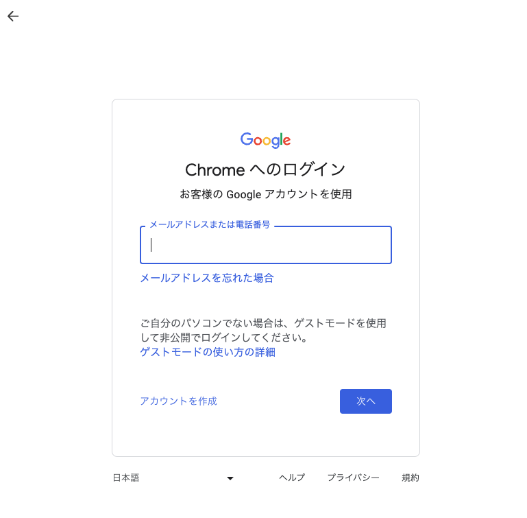
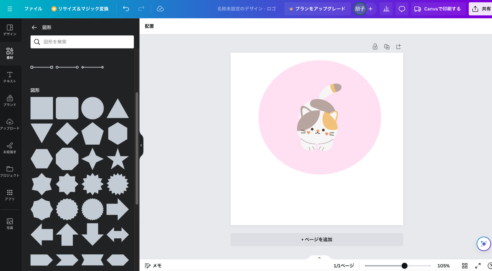
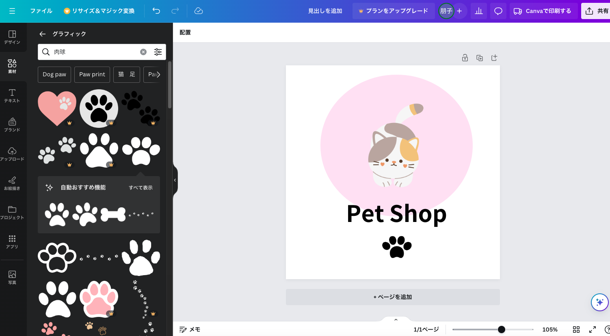

# **01 オリエンテーション**

## **この単元でやること**

1. 自己紹介
2. コース説明
3. このコースで作るサイトの紹介
4. HTMLとCSSの役割
5. 制作の流れ
6. 【演習】環境構築

  

### **1. 自己紹介**

- 名前（ニックネーム　何て呼んでほしい？）
- キャンパス（住んでいるところ）
- 好きなこと
- このコースを受講したきっかけ
- その他

  

### **2. コース説明**

- 動画視聴（20~30分）

  

### **3. このコースで作るサイトの紹介**

#### **①サンプルサイト**
サンプルコードを見ながら制作します  

https://programing-course.github.io/website/samplesite

#### **②自己紹介サイト**

自己紹介サイトを制作します  
１ページ目はガイドにそって、サンプルサイトで習ったことを思い出して制作  
２ページ目は「好きなこと（もの）を紹介する」ページを自由に制作  

#### **③練習問題**  

授業で習ったことを復習します  

https://programing-course.github.io/website/practice/html/

#### **④Webアワード**

コンテスト作品の作成  
Webサイトの企画から制作、プレゼンテーションを行います

  

### **4. HTMLとCSSの役割（P10）**
 

### **`HTMLはWebサイトの土台` (Hyper Text Markup Language)**

  

  コンピューターが情報の意味を読み取るための共通言語（マークアップ言語）  
  マークアップとは、「ここが文字」「ここが画像」のように文字列に`意味を持つマークをつける`こと  

   

  この講座で制作するサイトを例にみてみましょう  
  赤い枠の部分の情報にHTMLの`タグ`と呼ばれるマークをつけて、コンピューターが意味を読み取れるようにします。
  

 

### **`CSSは配置やデザイン`（Cascading Style Sheets）**

   

  見た目を指定する言語  
  色をつけたり、大きさを変えたり、配置を設定したり

  

### **5. 制作の流れ（P16~22）**

figmaやfigjamを使ってサイトマップやワイヤーフレームを作成します。  
https://www.figma.com/

  

## **演習**

### **Webサイトを作る準備をしよう！（環境構築）**

1. VSCodeインストール
2. chromeインストール・設定
3. Chromeの設定
4. googleアカウントの作成
5. Canva,figmaの登録
6. Canvaを使ってみよう
7. figmaを使ってみよう
8. いろいろなサイトを見てみよう

  

### **1. VSCodeインストール**

必要なアプリをインストールする

VSCode・・・テキストエディタと呼ばれる編集アプリを使ってHTMLやCSSのプログラムを書きます

- https://code.visualstudio.com/download

  

### **①自分のパソコンのOSに合ったインストーラーを使用**  
クリックするとダウンロードが自動で始まります

 

### **②画面右上（または左下）のアイコンでダウンロードの進行状況が確認できます**  

  

### **③ダウンロードが終わるとexeファイルが表示されるのでクリックしてインストールします**  

 

### **④「同意する」にチェック「次へ」**

 

### **⑤「デスクトップ上にアイコンを作成する」にチェック「次へ」**　
　　

 

### **⑥「インストール」**
　　

 

### **⑦表示スタイルを選択**
　　

 

### **⑧日本語化**  
　　

 

  

### **2. chromeインストール・設定**
ブラウザ・・・Webサイトを閲覧することができるソフト

- https://www.google.com/intl/ja_jp/chrome/

  
  
  

  

### **3. Chromeの設定**

- 既定値の設定をchromeに設定する

【windows】  
設定 > アプリ > 既定のアプリ

 

【mac】  
設定 > デスクトップとDock > デフォルトのWebブラウザ

  

### **4. googleアカウントの作成**

googleのアカウント「XXXX@gmail.com」のアドレスを持っていない人は作りましょう。  

### **5. Canva,figmaの登録**

webサイト上でロゴを作ったり、ワイヤーフレームやデザインすることができるツール  

gooleアカウントでログインして無料で使用できます。 
これからたくさん使用するのでブックマークしておきましょう。   
ログインしてみましょう。  

- figma　https://www.figma.com/  
- Canva　https://www.canva.com/

  

### **6. Canvaを使ってみよう**

  

### **7. figmaを使ってみよう**

**サンプルサイトのワイヤーフレーム**

  

### **8. いろいろなサイトを見てみよう**

- コーポレートサイト  
  企業の情報を掲載している公式サイト  
  https://www.mazda.co.jp/

- プロモーションサイト  
  サービスやイベントの告知に使うサイト  
  https://www.tokyo-solamachi.jp/

- ポートフォリオサイト  
  デザイナーやアーティストが自身の作品や制作実績を紹介するサイト  
  https://sato-takaaki.work/

- ショッピングサイト  
  商品を販売するサイト  
  https://www.rakuten.co.jp/

- メディアサイト  
  ニュースや読み物記事、特定の分野に特化して情報配信しているサイト  
  https://gamewith.jp/

- Webサイトギャラリー  
  https://sankoudesign.com/
  
  
