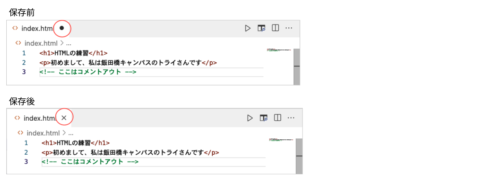

# **02 HTML基礎**

## **この単元でやること**

1. サイトに必要なフォルダやファイルについて
2. タグの書き方
3. 【演習】HTMLを書いてみよう

<br>

### **1. サイトに必要なフォルダやファイル**

Webサイトに必要なファイルや画像をフォルダにまとめて管理します  
サンプルサイトのフォルダの構成を確認しよう


### **拡張子とは**


### **フォルダ名、ファイル名の付け方**

- `半角英数字でつける`　ひらがなや漢字を使うと正しく表示されない場合がある  
- 記号は「`-`(ハイフン)」「`_`(アンダーバー)」のみ使用する  
- トップページは必ず`index.html`  
- そのページがどのような内容のページかわかるように命名しよう  

<br><br>

### **2. タグの書き方**


<br><br>

## **演習**

### **HTMLを書いてみよう**

1. フォルダ、ファイルの作り方
2. タグを書こう
3. 保存・サイトを表示しよう
4. ショートカットキーの練習

<br><br>

### **1. フォルダ、ファイルの作り方**

まずはプログラムを保存しておくフォルダやファイルを作ろう

1. デスクトップに「プログラミング」フォルダを作成


2. VSCodeを開いてフォルダをドラッグ
   


3. 「`サイトの作り方`」フォルダを作成  
   フォルダの中に以下を作成  

- 「`index.html`」ファイル作成
- 「`style.css`」ファイル作成
- 「`images`」フォルダ作成


<br><br>

### **2. タグを書こう**

### **index.htmlに書いてみよう**
```html

<h1>HTMLの練習</h1>
<p>はじめまして、私は⚪︎⚪︎キャンパスの⚪︎⚪︎です</p>
<!--コメントアウト-->

```
### **書き方のコツ**


<br><br>

### **3. 保存してサイトを表示しよう**

### **保存**  

  `[ctrl] + [s]`  
  `[command] + [s]`
  


### **ブラウザで表示しよう**

「デスクトップ」>「プログラミング」>「サイトの作り方」>`index.html`をダブルクリック  


**＜ブラウザ表示＞**


<br><br>

### **4. ショートカットキーの練習**

### **コピー**  

`[ctrl] + [c]`  
`[command] + [c]`

### **貼り付け** 

`[ctrl] + [v]`  
`[command] + [v]`

`操作のコツ：[ctrl]キーを押しながら、[c]や[v]キーを１回ポンと押す`

<br><br>

下のコードをショートカットキーを使ってコピペしてください  

```html

<a href="https://www.try-gakuin.com/?gad_source=1&gclid=Cj0KCQjwpNuyBhCuARIsANJqL9N-asIglRM1zJWPxCz6tHcQlg753SLNT_kFCrpCjr73cJ_ClfOg4C8aAgzEEALw_wcB">トライ式高等学院</a>

```

```html

<h2>好きな食べ物は</h2>
<ul>
  <li>オムライス</li>
  <li>カレー</li>
  <li>寿司</li>
</ul>

```

<br><br>
