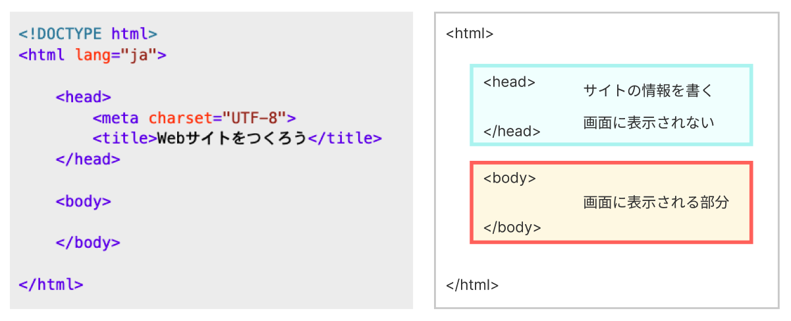
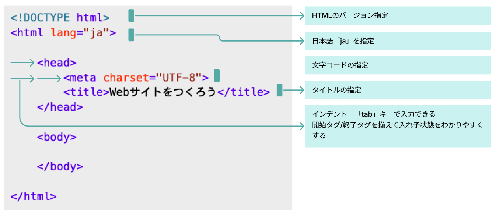
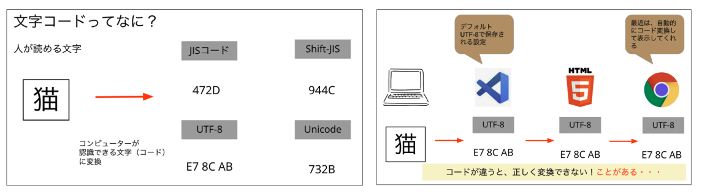
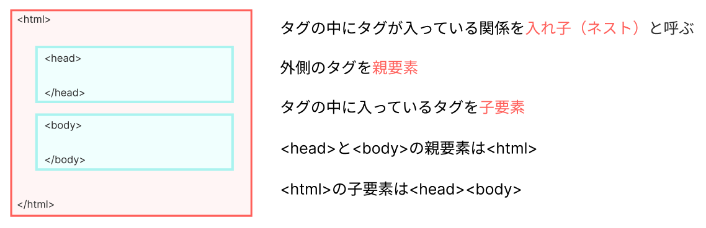
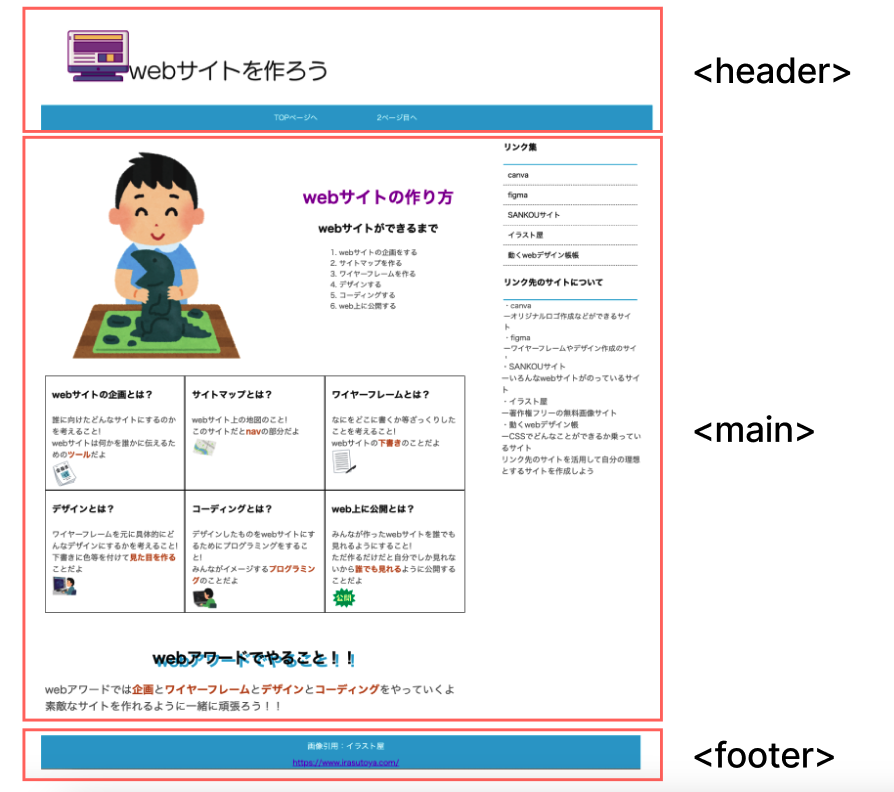
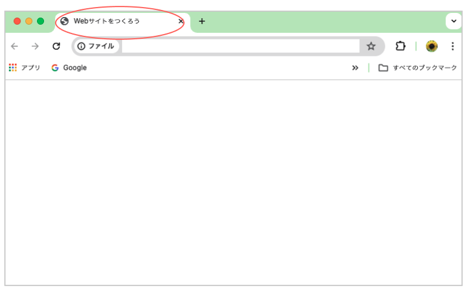

# **03 HTML基本構造**

## **この単元でやること**

1. HTMLの基本構造
2. グループタグ
3. 【演習】サンプルサイトを作ろう（ベースとグループタグ）

<br>

### **この単元で使用するタグ一覧**

|  タグ  |  種類  | 説明  | 参考書  |
| :---- | :---- | ---- | ---- |
|  `<html>`  |  基本構造  |  一番外側に必ず書く  | 39 |
|  `<head>`  |  基本構造  |  サイトの情報を書く場所<br>画面上見えない部分  | 40 |
|  `<body>`  |  基本構造  |  画面上表示させるものを書く場所  | 40 |
|  `<header>`  |  ヘッダーグループ  |  ページの上部の部分  | 44-47 |
|  `<main>`  |  メイングループ  |  メインコンテンツの部分  | 44-47 |
|  `<footer>`  |  フッターグループ  |  ページの下部の部分  | 44-47 |

<br><br>

### **1. 基本構造とheadの中身(P39~42)**

<br>

### **①必ず書く基本のコード**



<br><br>

### **②コードの説明**


<br><br>

### **③文字コードとは**



<br><br>

### **④親子関係**



<br><br>

### **2. グループを作る(P43~48)**



<br><br>

## **演習**

### **サンプルサイトを作ろう**

1. 基本のコードを書こう
2. グループタグを書こう

<br>

### **完成画面**

グループを作っただけなので画面には表示されません  
ブラウザのタブにタイトルが表示されます

　　


<br><br>

### **1. 基本構造**

「サイトの作り方」のindex.htmlに書く

`前回書いたindex.htmlのコードは全て消して新しくコードを書きましょう`

**ポイント**  

- 入力補完をうまく使おう
- インデントを入れて、タグのまとまりをわかりやすくしよう

```html

<!DOCTYPE html>
<html lang="ja">

    <head>
        <meta charset="UTF-8">
        <title>Webサイトをつくろう</title>
    </head>

    <body>
    </body>

</html>

```

<br><br>

### **2. グループタグ**

コメントアウトの部分は書かなくて良いです

```html

<!DOCTYPE html>
<html lang="ja">

    <head>
        <meta charset="UTF-8">
        <title>Webサイトをつくろう</title>
    </head>

    <body>
        <!--ここから-->
        <header>
            
        </header>
        <main>
            
        </main>
        <footer>
            
        </footer>
        <!--ここまで-->
    </body>

</html>

```

<br><br>