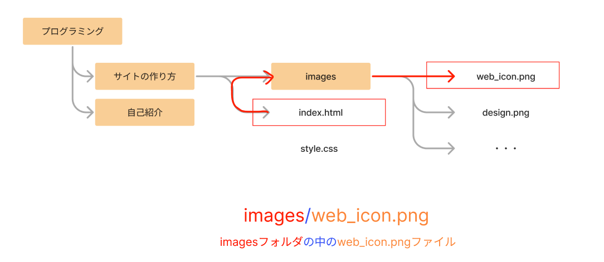
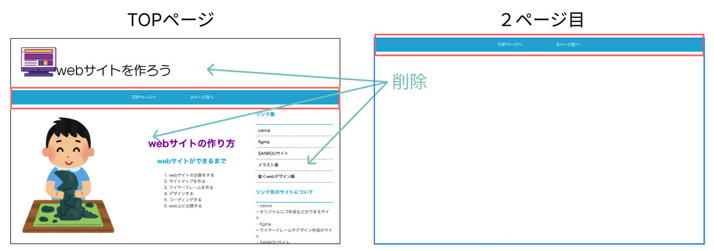

# **04 HTMLコンテンツ（header部分）**

## **この単元でやること**

1. ナビゲーションを作るタグ
2. 【演習】header部分・ナビゲーションを作ろう・２ページ目の土台を作ろう

<br>

### **完成画面**

　


### **この単元で使用するタグ一覧**
|  タグ  |  種類  | 説明  | 参考書  |
| :---- | :---- | ---- | ---- |
|  ``  |  画像表示<br>インライン要素  |  src="画像ファイルの場所を指定"<br>alt="画像が表示できなかったときの代替文字"  | 50 |
|  `<nav>`  |  ナビゲーション  |  主にグローバルナビゲーションを作るグループ  | 45 |
|  `<ul><li>`  |  リスト<br>`u`n ordered `l`ist  |  箇条書き  | 57 |
|  `<a href="" >`  |  リンク<br>anchor<br>インライン要素  |  `<a href="" target="_blank">`<br> リンク先を別タブで開く  | 50 |

<br><br>


### **1. 画像を表示する**　　

<br>

### **①img要素``**　　

<br>

**コード例**
```html


```

<br>


### **②ファイルパスの考え方**

<br>


- 同じフォルダに入っている「フォルダ」や「ファイル」は`同じディレクトリにある`という
- 「サイトの作り方」と「自己紹介」フォルダは`同じディレクトリ`
- 「index.html」と「style.css」ファイルは`同じディレクトリ`
- 「index.html」と「web_icon.png」ファイルは`別ディレクトリ`

<br>

### **③パスの書き方**

<br>

`images`フォルダに入っている`web_icon.png`を画面に表示する場合  
index.htmlからディレクトリを辿ってパス（ルート）を指定します

<br>

　　

<br>

### **④パスが間違っていたり、ファイルがないと・・・**

<br>

画像が表示されず`alt`で指定した文字が表示されます


<br>

### **⑤`alt="代替文字"`の役割**

<br>

altの文字は音声ブラウザなどで読み上げられるの「どのような画像か説明する文字」を書く


<br><br>

### **2.グローバルナビゲーションを作る**

<br>

グローバルナビゲーションはWebサイト内の主になるページへのリンクの部分  

一般的に`<nav>`要素、`<ul><li>`要素、`<a>`要素を組み合わせて作ります

```html

<nav>
    <ul>
        <li><a href="index.html">TOPページへ</a></li>
        <li><a href="next_page.html">2ページ目へ</a></li>
    </ul>
</nav>
```

<br>

### **①nav要素`<nav>`**

<br>

ナビゲーションのグループ

<br>

### **②箇条書きリスト`<ol><li>`と`<ul><li>`**

箇条書きリストには順番を持つリストと持たないリストがあります。  
ナビゲーションでは順番を持たない`<ul>`使います。

<br>

### **`<ol>`は`「ordered list」`の略**

`<li>`はリスト（箇条書き）を意味している  
順番のある項目を並べるときに使います  


<br>

### **`<ul>`は`「un ordered list」`の略**  
`un`は否定  
順番をもたない項目を並べるときに使います  


<br>

### **③リンク`<a href="ファイルパス">`**

<br>

### **リンク先のURLを指定する方法（絶対パス）**  
httpsから始まるしサイトのアドレスを指定します  

```html
<!-- 絶対パスで指定 -->
<a href="https://google.com">
```

<br>

### **別ページのファイル名を指定する方法（相対パス）**  
今、表示しているページからのルートを指定  
同じディレクトリ（フォルダ）内のファイルに画面遷移する場合はファイル名のみ指定します  
（わからない場合は上に戻って、「ファイルパスの考え方」の部分を復習しよう
```html
<!-- 相対パスで指定 -->
<a href="nextpage.html">
```

### `注意!!`  
下記のようにファイルのパスをコピーして指定しないようにしましょう  
他の人のパソコンではパスが異なるためエラーになります
```html
<a href="/Users/aaa/Documents/プログラミング/nextpage.html">
```

<br>

**指定したURLがない、ファイルがないとき**  
エラーになります  


<br><br>

## **演習**

### **ヘッダー部分・ナビゲーションを作ろう**


<br><br>

### **1.`<header>`部分**  

```html

<body>
    <header>
        
        <nav>
            <ul>
                <li><a href="index.html">TOPページへ</a></li>
                <li><a href="next_page.html">2ページ目へ</a></li>
            </ul>
        </nav>
    </header>
    <main>
        
    </main>
    <footer>
        
    </footer>
</body>

```

今の状態だと画像が表示されません・・・  
`images`フォルダの中に画像ファイルを入れよう

- 教材サイト > 演習画像フォルダ　の中の画像をダウンロード
- ダウンロードフォルダに画像が入る
- Webサイトの作り方 > imagesフォルダ　の中に移動させる

### **2.２ページ目を作る**  

「2ページ目へ」ボタンが押された時に「`next_page.html`」にリンクするように指定しました  
２ページ目の土台をつくろう

### **２ページ目の作り方**

Webサイトには複数ページに共通して使われている部分がある  
サンプルサイトではヘッダーのナビゲーションの部分が共通部分  
`index.html`をコピーして、共通部分だけを残していらない部分は削除するやり方で２ページ目を作ります



①`index.html`をコピー  
右クリックして`Ctrl+C` `Ctrl+V` (`command+C` `command+V`)


②`next_page.html`に名前を変更  

右クリック＞名前の変更  


③共通部分以外を削除する  

`next_page.html`の共通部分以外を削除  

