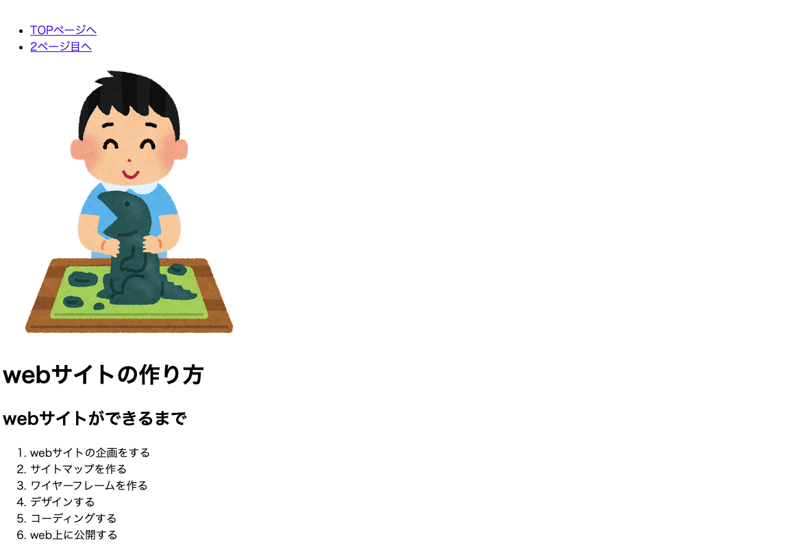
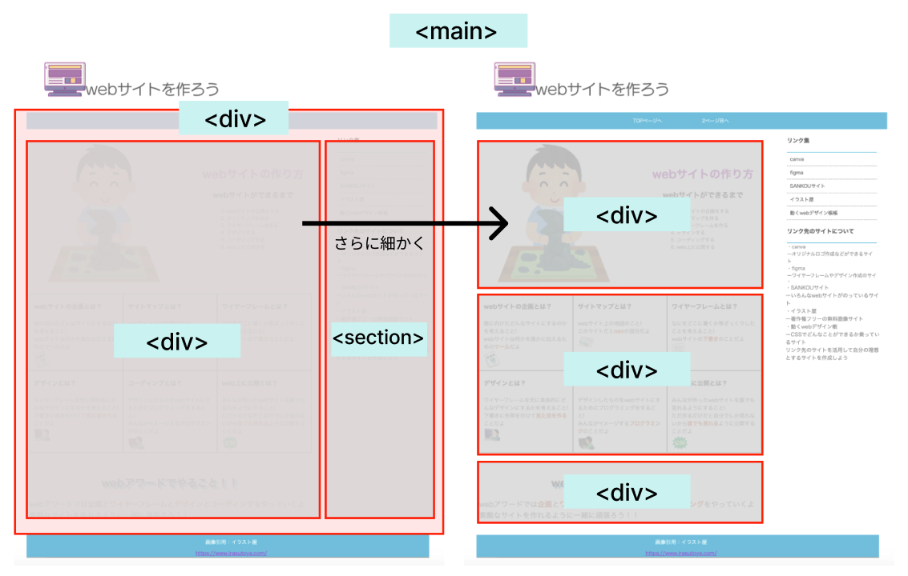
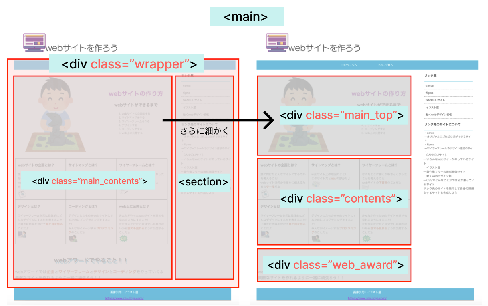
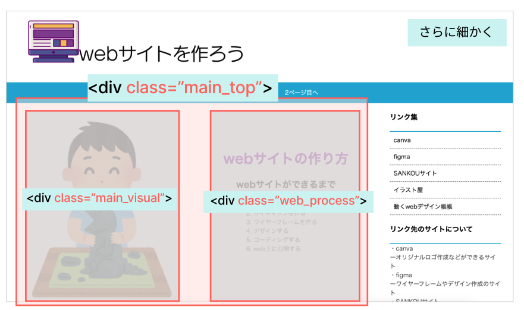
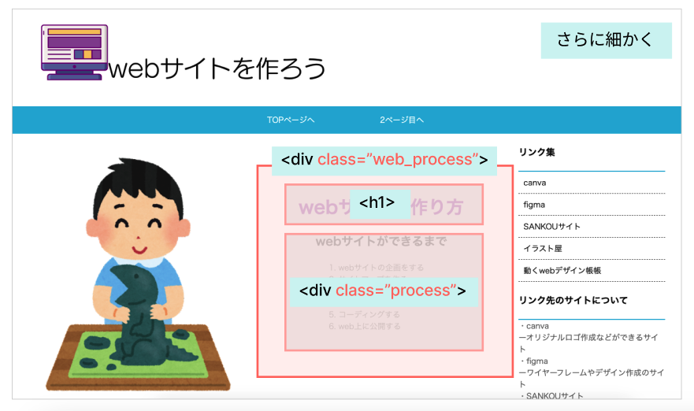

# **05 メインコンテンツ（上）**

## **この単元でやること**

1. div classでグループ化
2. メインコンテンツを書く（見出し・箇条書き）
3. 【演習】メインの部分グループ化

<br>

### **完成画面**


<br>

### **この単元で使用するタグ一覧**

|  タグ  |  種類  | 説明  | 参考書  |
| :---- | :---- | ---- | ---- |
|  `<div>`  |  特別な意味を持たないグループ  |  class属性をつけて区別する  |    |
|  `<section>`  |  テーマを持ったグループ  |  見出し毎のグループに使われる  |  46  |
|  `<h1>〜<h6>`  |  見出し  |  重要度に合わせて使い分ける  |  31  |
|  `<ol><li>`  |  リスト<br>`o`rdered `l`ist  |  順番のある項目を箇条書き  | 57   |


<br><br>


### **1. class属性（タグに名前をつけよう）**　　
<br>
 
「03_HTML_bace_group」で`<header>` `<main>` `<footer>`タグを使ってグループを作りました。  
グループタグには意味を持たない`<div>`タグがあります。  
メインコンテンツを`<div>`タグでさらにグループ分けしていきます。  

<br>



<br>

`<div>`タグがたくさんあって、どこの`<div>`なのか区別がつきません。  
HTMLタグに`class属性`を追加することで、名前をつけることができます。 



<br>

  

### **`class属性`の書き方**  

- 半角の英数字
- 先頭に数字は禁止（ダメな例：class="01name"）
- 記号は「`_`」アンダースコア、「`-`」ハイフン　のみ使う
  
```html

<div class="main_content">
</div>

<h1 class="name">
</h1>

<p class="main-text">
</p>

```

**さらに細かくグループ分け**



<br>

**さらに細かくグループ分け**



<br>

### **2. 見出しをつける`<h1><h2>`**

`h`はheadingの頭文字  
`<h1>`〜`<h6>`  
`<h1>`：大見出し  
`<h2>`：中見出し  
`<h3>`：小見出し  
.....

`<h6>`：小見出し  


重要度に合わせて使い分けます  

<br>

### **3. 箇条書きリストの追加`<ol>`**

（復習）
順番のある項目を箇条書きにします

<br>

## **演習**

### **メインコンテンツのグループ化**

<br>

### **1.`<main>`の中にメインコンテンツのグループを作る**  


```html

<body>
    <!-- 省略 -->
    <main>
        <div class="wrapper">
            <!-- メインコンテンツ -->
            <div class="main_contents">
                <!-- メイン上部 -->
                <div class="main_top">
                   
                </div>
                <!-- メイン中央 -->
                <div class="contents">

                </div>
                <!-- メイン下部 -->
                <div class="web_award">

                </div>
            </div>
            <!-- サイドのコンテンツ -->
            <section>
            
            </section>
        </div>
    </main>
    <footer>
        
    </footer>
</body>

```

### **2.さらに細かくグループをつくる**  
  
```html

<body>
    <!-- 省略 -->
    <main>
        <div class="wrapper">
            
            <div class="main_contents">
                
                <div class="main_top">
                    <!-- 追加 ここから -->
                    <div class="main_visual">

                    </div>

                    <div class="web_process">
                        <div class="process">
                            
                        </div>
                    </div>
                    <!-- 追加 ここまで -->
                </div>
               　
                <div class="contents">

                </div>
                
                <div class="web_award">

                </div>
            </div>

            <section>
            
            </section>
        </div>
    </main>
    <footer>
        
    </footer>
</body>

```

### **3.メインコンテンツの中を書く**  

```html

<main>
    <div class="wrapper">
        <div class="main_contents">
            <div class="main_top">

                <div class="main_visual">
                    
                </div>
                
                <div class="web_process">
                    <h1>webサイトの作り方</h1>
                    <div class="process">
                        <h2>webサイトができるまで</h2>
                        <ol>
                            <li>webサイトの企画をする</li>
                            <li>サイトマップを作る</li>
                            <li>ワイヤーフレームを作る</li>
                            <li>デザインする</li>
                            <li>コーディングする</li>
                            <li>web上に公開する</li>
                        </ol>
                    </div>
                </div>

            </div>

            <div class="contents">

            </div>
            
            <div class="web_award">

            </div>
            
        </div>
        <section>
        
        </section>
    </div>
</main>

```

## **自己紹介サイト**

### **１ページ目のガイド**

1. ヘッダー部分に２ページ目のリンクを作る

- ２ページ目のファイル名は「favorite.html」とする
- リンクの文字は「favorite」とする

2. メインの部分に紹介コンテンツを表示

- タイトルを表示
- メインビジュアル画像を表示
- 個人情報を表示

<br><br>