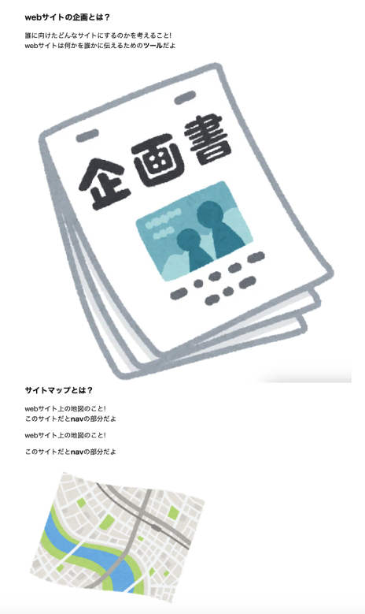
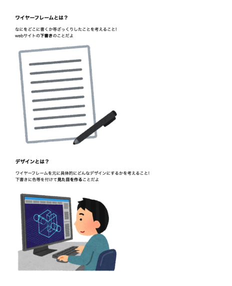
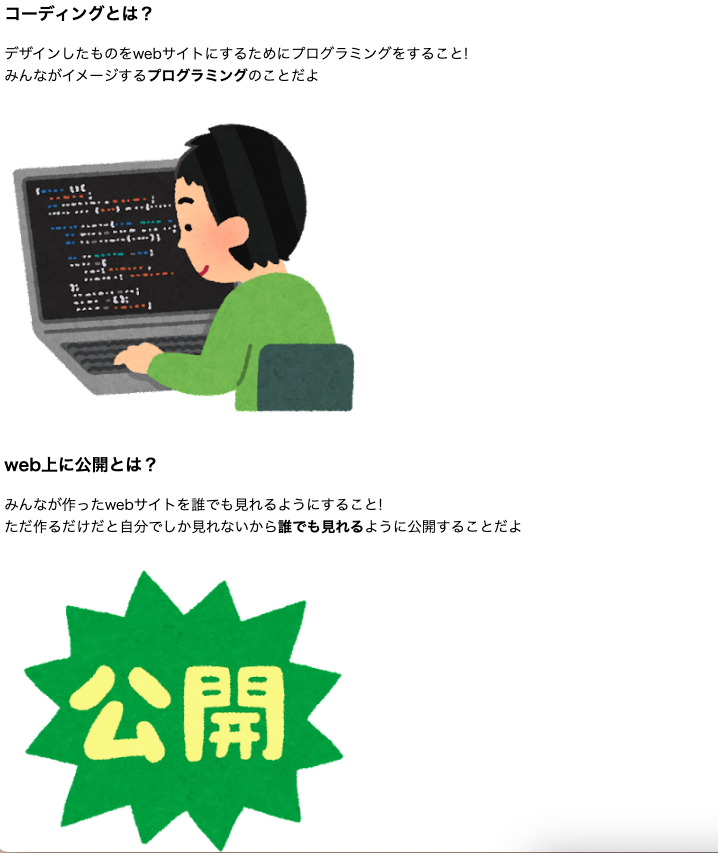
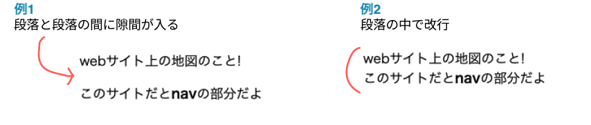
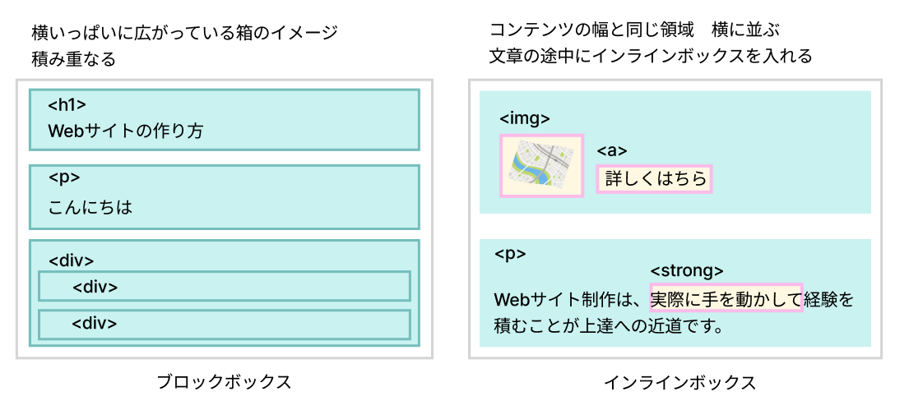
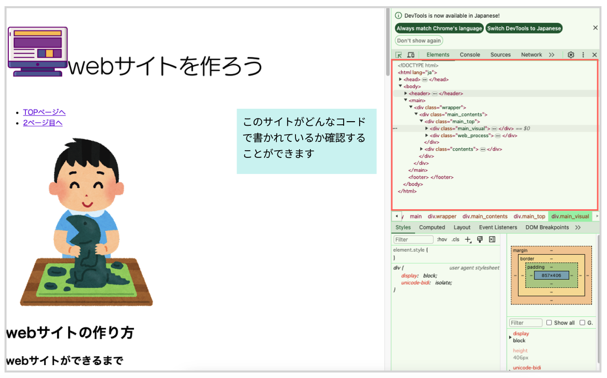
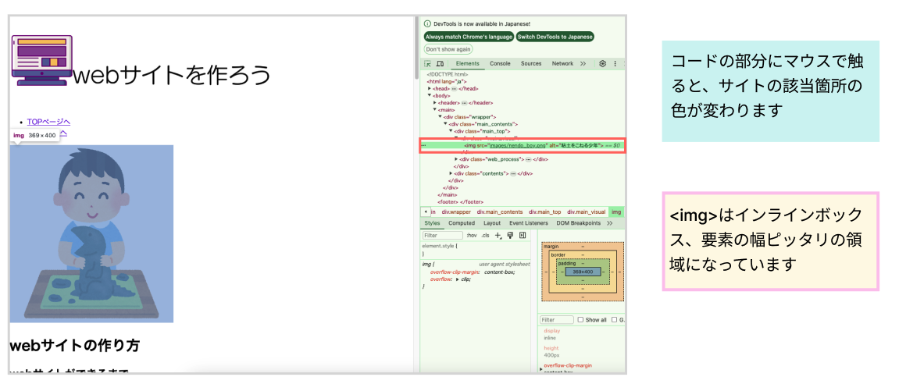
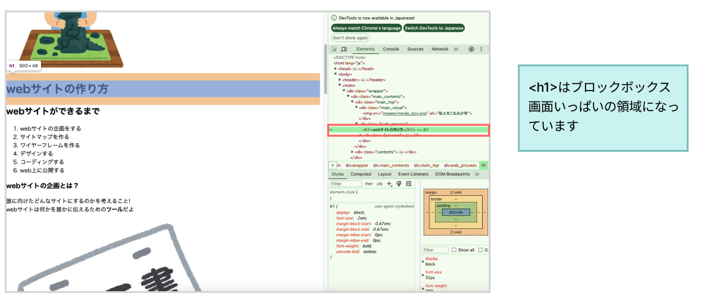
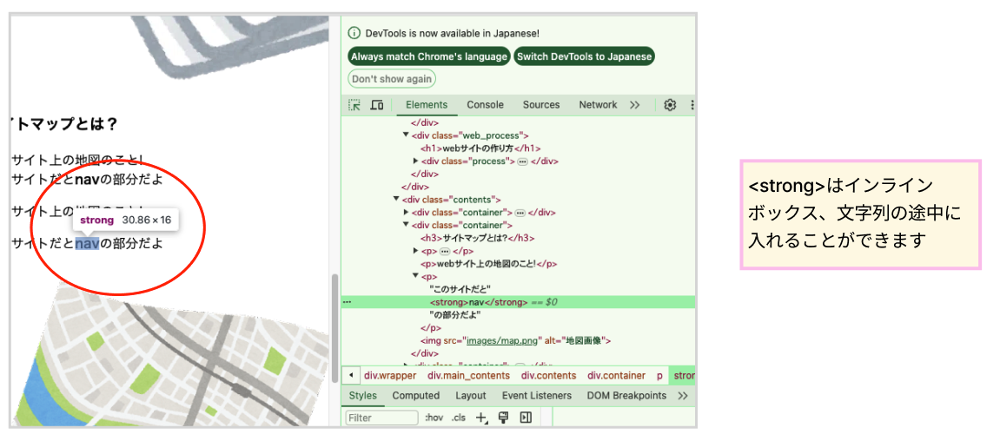

# **06 メインコンテンツ（中）**

## **この単元でやること**

1. 文章を入れる
2. ブロックボックスとインラインボックス
3. 【演習】メインコンテンツを書こう
4. 【演習】検証ツールを使ってみよう

<br>

### **完成画面**


  
  
  

<br>

### **この単元で使用するタグ一覧**

|  タグ  |  種類  | 説明  | 参考書  |
| :---- | :---- | ---- | ---- |
|  `<h3>`  |  小見出し  |    |  31  |
|  `<p>`  |  段落<br>`p`aragraph  |    |  31  |
|  `<strong>`  |  強調（警告）  |  `<em>` `<b>`なども強調  |  51  |
|  `<br>`  |  改行  |    |  53  |


<br><br>

### **1. 文章`<p><br><strong>`**

- `<p>`で囲まれた部分が段落になる
- 段落ごとに改行され、段落の間に余白が入る
- 文章の途中で改行したい場合`<br>`を入れて改行することもできる
- 強調したい文字を`<strong>`で囲う

<br>

**例１ `<p>`タグで段落わけ**
```html

<p>webサイト上の地図のこと!</p>
<p>このサイトだと<strong>nav</strong>の部分だよ</p>

```

**例２ `<br>`で改行**
```html

<p>webサイト上の地図のこと!<br>このサイトだと<strong>nav</strong>の部分だよ</p>

```
<br>

**`<p>`の改行と`<br>`の改行を比較**
<br>



<br>

### **2. ブロックボックス（ブロック要素）とインラインボックス（インライン要素）**

<br>

HTMLの要素は主に`ブロックボックス`と`インラインボックス`２種類の性質を持っています。

<br>



<br>

**ここでは代表的な`インラインボックス`を覚えておきましょう!!**  
``　画像を表示する  
`<a>`  リンクをはる  
`<strong>`　文字を強調する  
`<span>`　インラインにおけるdivのような使い方


<br><br>

## **演習**

### **メインコンテンツ（中）のグループ化**

<br>

### **1.`<div class="contents">`の中にメインコンテンツのグループを作る**  

  
 - `<div class="container"></div>`を一つ書いたら、コピペで他のグループを作ろう！！  
 - windows:「Ctrl + C」「Ctrl + V」
 - mac:「Command + C」「Command + V」

<br>

```html

<body>
    <!-- 省略 -->
    <main>
        <div class="wrapper">
            <div class="main_contents">
                
                <!-- 省略 -->
                
                <div class="contents">
                    
                    <!-- 追加 -->
                    <div class="container">
                        
                    </div>

                    <div class="container">
                        
                    </div>

                    <div class="container">
                        
                    </div>

                    <div class="container">
                        
                    </div>

                    <div class="container">
                        
                    </div>

                    <div class="container">
                        
                    </div>
                    <!-- 追加 -->
                    
                </div>
            </div>
            <section>
            
            </section>
        </div>
    </main>
    <footer>
        
    </footer>
</body>

```

### **2.コンテンツの中を書こう**  
  
```html

<body>
    <!-- 省略 -->
    <main>
        <div class="wrapper">
            
            <div class="main_contents">
                
               　<!-- 省略 -->

                <div class="contents">

                    <div class="container">
                        <h3>webサイトの企画とは？</h3>
                        <p>誰に向けたどんなサイトにするのかを考えること!<br>webサイトは何かを誰かに伝えるための<strong>ツール</strong>だよ</p>
                        
                    </div>

                    <div class="container">
                        <h3>サイトマップとは？</h3>
                        <p>webサイト上の地図のこと!<br>このサイトだと<strong>nav</strong>の部分だよ</p>
                        
                    </div>

                    <div class="container">
                        <h3>ワイヤーフレームとは？</h3>
                        <p>なにをどこに書くか等ざっくりしたことを考えること!<br>webサイトの<strong>下書き</strong>のことだよ</p>
                        
                    </div>

                    <div class="container">
                        <h3>デザインとは？</h3>
                        <p>ワイヤーフレームを元に具体的にどんなデザインにするかを考えること!<br>下書きに色等を付けて<strong>見た目を作る</strong>ことだよ</p>
                        
                    </div>

                    <div class="container">
                        <h3>コーディングとは？</h3>
                        <p>デザインしたものをwebサイトにするためにプログラミングをすること!<br>みんながイメージする<strong>プログラミング</strong>のことだよ</p>
                        
                    </div>

                    <div class="container">
                        <h3>web上に公開とは？</h3>
                        <p>みんなが作ったwebサイトを誰でも見れるようにすること!<br>ただ作るだけだと自分でしか見れないから<strong>誰でも見れる</strong>ように公開することだよ</p>
                        
                    </div>
                </div>
                
                <div class="web_award">

                </div>
            </div>

            <section>
            
            </section>
        </div>
    </main>
    <footer>
        
    </footer>
</body>

```

<br>

### **3.検証ツールの使い方**

- ブラウザ上で「右クリック」＞「検証」をクリック
- HTMLのコードの部分をクリックして`インラインボックス`と`ブロックボックス`の違いを確認しよう

<br>

このサイトがどのようなコードで書かれているか確認することができます。  
自由にさわって、確認してみよう。  







