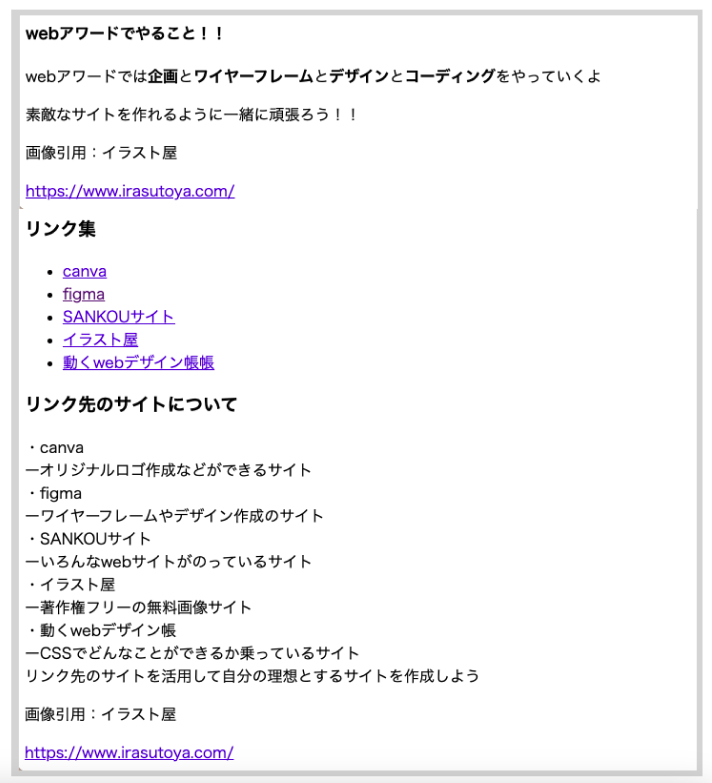
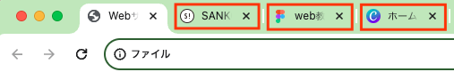

# **07 メインコンテンツ（その他）**

## **この単元でやること**

1. target="_blank"
2. 【演習】残りのコンテンツを書こう

<br>

### **完成画面**



### **1.別タブでリンクを表示**

リンク先のサイトを別タブで表示できる  
外部リンク（自分のサイトではないリンク）を表示するときは別タブで表示する  
ページを閉じずに他のページを開いて情報を取得できるので便利です

`a`タグに`target="_blank"`を追加します



<br><br>


## **演習**

<br>

**これまでに習ったタグがたくさんでてきます。意味を思い出しながら書こう！！**

### **1.`<div class="web_award">`の中を書く**  
  
<br>

```html

<body>
    <!-- 省略 -->
    <main>
        <div class="wrapper">
            <div class="main_contents">
                
                <div class="main_top">
                    <!-- 省略 -->
                </div>
                
                <div class="contents">
                    <!-- 省略 -->
                </div>

                <div class="web_award">
                    <h4>webアワードでやること！！</h4>
                    <p>webアワードでは<strong>企画</strong>と<strong>ワイヤーフレーム</strong>と<strong>デザイン</strong>と<strong>コーディング</strong>をやっていくよ
                    </p>
                    <p>素敵なサイトを作れるように一緒に頑張ろう！！</p>
                </div>
            </div>
            <section>
                
            </section>
        </div>
    </main>
    <footer>
        
    </footer>
</body>

```

### **2.`<footer>`の中を書く**

- URLはコピペしてよいです

<br>

```html

<!-- 省略 -->
    <main>
        <div class="wrapper">
            <div class="main_contents">
                
                <div class="main_top">
                    <!-- 省略 -->
                </div>
                
                <div class="contents">
                    <!-- 省略 -->
                </div>

                <div class="web_award">
                    <!-- 省略 -->
                </div>
            </div>
            <section>
                
            </section>
        </div>
    </main>
    <footer>
        <p>画像引用：イラスト屋</p>
        <a href="https://www.irasutoya.com/" target="_blank">https://www.irasutoya.com/</a>
    </footer>
</body>

</html>
```

### **3.`<section>`の中を書く**  

- URLはコピペしてよいです
  
```html

<body>
    <!-- 省略 -->
    <main>
        <div class="wrapper">
            <div class="main_contents">
                
                <div class="main_top">
                    <!-- 省略 -->
                </div>
                
                <div class="contents">
                    <!-- 省略 -->
                </div>

                <div class="web_award">
                    <!-- 省略 -->
                </div>
            </div>
            <section>
                <h3 class="link_set">リンク集</h3>
                <ul class="link_menu">
                    <li><a href="https://www.canva.com/ja_jp/" target="_blank">canva</a></li>
                    <li><a href="https://www.figma.com/ja/" target="_blank">figma</a></li>
                    <li><a href="https://sankoudesign.com/" target="_blank">SANKOUサイト</a></li>
                    <li><a href="https://www.irasutoya.com/" target="_blank">イラスト屋</a></li>
                    <li><a href="https://coco-factory.jp/ugokuweb/" target="_blank">動くwebデザイン帳</a></li>
                </ul>

                <h3 class="info">リンク先のサイトについて</h3>
                <p>・canva<br>ーオリジナルロゴ作成などができるサイト<br>
                    ・figma<br>ーワイヤーフレームやデザイン作成のサイト<br>
                    ・SANKOUサイト<br>ーいろんなwebサイトがのっているサイト<br>
                    ・イラスト屋<br>ー著作権フリーの無料画像サイト<br>
                    ・動くwebデザイン帳<br>ーCSSでどんなことができるか乗っているサイト<br>
                    リンク先のサイトを活用して自分の理想とするサイトを作成しよう
                </p>
            </section>
        </div>
    </main>
    <footer>
        <p>画像引用：イラスト屋</p>
        <a href="https://www.irasutoya.com/" target="_blank">https://www.irasutoya.com/</a>        
    </footer>
</body>

```

<br>

