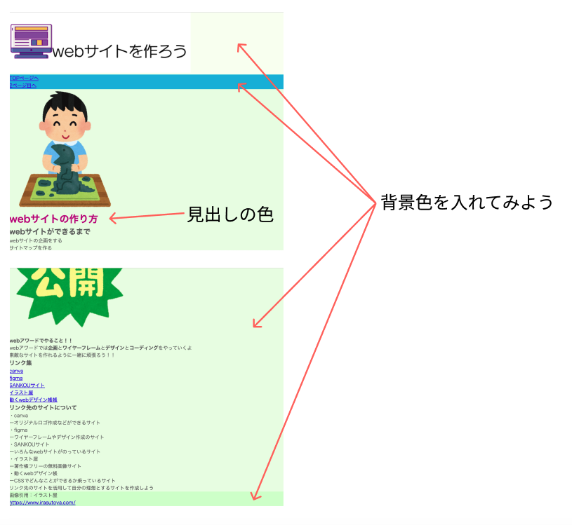
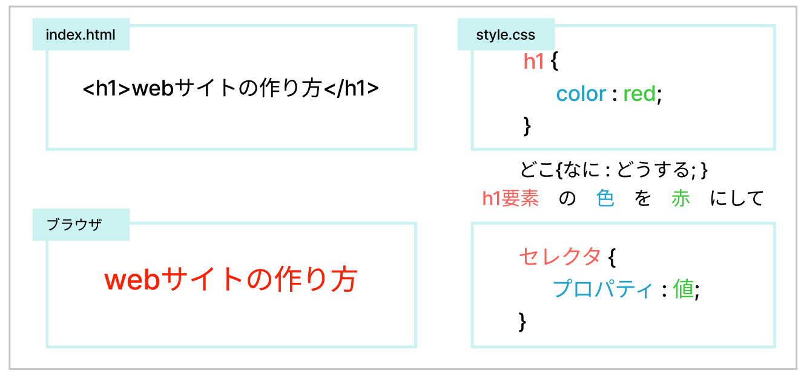

# **08 CSSの基礎**

## **この単元でやること**

1. CSSの書き方
2. CSSを書く場所
3. 優先順位
【演習】cssを書いてみよう

<br>

### **完成画面**



<br><br>

### **1. CSSの書き方**

```css

h1 {
    color: red;
}

.name{
    color: red;
}

#content {
    color: red;
}

```

<br>




<br><br>

### **2. CSSを書く場所**

<br>

CSSを書く場所は３パターン  
基本的に下記`① CSS専用のファイルを作成　HTMLで読み込んで適用`する方法が一般的です。  
特別な理由がない限りパターン②③の方法は使いません。

### **① CSS専用のファイルを作成　HTMLで読み込んで適用**


```html

<head>
    <meta charset="UTF-8">
    <title>Webサイトをつくろう</title>
    <link rel="stylesheet" href="style.css">　<!--リンクを追加-->
</head>

```

HTMLファイルとCSSファイルを紐付ける


### **②HTMLファイル内の`<head>`の中に`<style>`タグで囲う**

```html

<head>
    <meta charset="UTF-8">
    <title>Webサイトをつくろう</title>
    <link rel="stylesheet" href="style.css">
    <!-- ⇩ここに書くパターン -->
    <style>
        h1 {
            color: red;
        }
    </style>
</head>

```

### **③ HTMLのタグに直接書く**

```html

<h1 style="color: red;">webサイトの作り方</h1>

```
### **CSSを別ファイルに書く理由**


<br><br>


### **3. 優先順位**

<br>

HTMLやCSSのコードは書いた順番に実行されます。  
下のコードは　`p`が２箇所書かれています。  
後に書いたコードが最終的に実行されてるので、結果が「緑色」になります。

```css

/* 赤 */
p {
    color:red;
}

h1{
    color:blue;
}

/* 緑 */
p{
    color:green;
}

```


CSSの書く順番は広い範囲から順番に書くように心がけましょう。


<br><br>

## **演習**

<br>

1. CSSのリンク
2. 背景色、文字色をつける
3. 色の変え方
4. リセットCSSを適用しよう

### **1.`<head>`の中に`style.css`のリンクを書く**  
  
<br>

index.html

```html

<head>
    <meta charset="UTF-8">
    <title>Webサイトをつくろう</title>
    <link rel="stylesheet" href="style.css">　<!--追加-->
</head>

```

<br><br>

### **2.CSSを書こう**  

**①練習のために仮で背景色を入れてみよう**  
入力して保存したら、ブラウザに表示して背景色がついていることを確認しましょう。

```css

/* 文字コードの指定 */
@charset "UTF-8";

body {
    background-color:aliceblue;
    color: rgb(95, 95, 95);
}

```

**②他のグループの背景色を入れよう**  
１つ書いたら、ブラウザで確認しながら進めましょう。

```css

header{
    background-color:rgb(250, 255, 240);
}

```

```css

main {
    background-color: rgb(236, 253, 227);
}
```

```css

footer{
    background-color: rgb(217, 255, 202);
}

```

```css

h1{
    color: #7b00b8;
}

```

```css

nav {
    background-color: #0bd;
}

```

**③`h1`をもう一つ追加して、優先順位を確認しよう**  
確認できたら、このコードは削除してよいです。

```css

/* 同じものを下に書いてみる */
h1{
    color: #b80087;
}

```

<br>

### **3.色の指定**

<br>

Red（赤）Green（緑）Blue（青）を組み合わせて表現する  


<br>


<br>


**VSCodeの「カラーピッカー」を使って変更してみよう**

<br>


<br>

### **４.リセットCSSの適用**

HTMLのタグにもともとついている余白を全てリセットします。


<br>

index.htmlの`<head>`の中にリセットするためのCSSをリンクします。  
コピペしてよいです。  
`style.cssのリンクよりも前に書く！！`  
後ろに書いてしまうと、せっかく書いたCSSがリセットさせれてしまいます。  

```html

<head>
    <meta charset="UTF-8">
    <title>Webサイトをつくろう</title>
    <!-- この1行を追加 -->
    <link rel="stylesheet" href="https://unpkg.com/ress/dist/ress.min.css">
    <link rel="stylesheet" href="style.css">
</head>

```

<br>