# **09 ナビゲーションの装飾**

## **この単元でやること**

1. 文字のサイズ・配置・デコレーション
2. 子孫セレクタ
3. ボックスモデル
4. インライン・ブロックの変更
5. 内側の余白
  
【演習】ナビゲーションを完成させよう

<br>

### **完成画面**

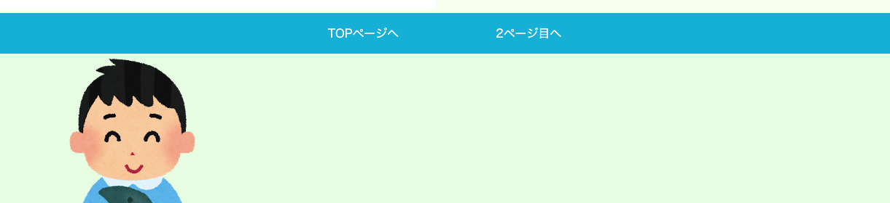

<br><br>

### **この単元で使用するプロパティ一覧**

|  プロパティ  |  意味  | 説明  | 参考書  |
| :---- | :---- | ---- | ---- |
|  `color`  |  文字の色  |  カラーコード　`#7b00b8`<br>RGB指定　`rgb(250, 255, 240`）  | 95-98,102 |
|  `background-color`  |  背景色  |  〃  | 〃 |
|  `font-size`  |  文字のサイズ  |  デフォルト：16px<br>[px] 画面幅が変わっても変わらない単位<br>[%] 親要素のサイズにより変化<br>[rem] htmlに指定したサイズ（2rem=2倍)  | 98 |
|  `text-align`  |  文字の配置  |  [left] 左揃え（デフォルト）<br>[center] 中央揃え<br>[right] 右揃え<br>[justify] 両端揃え<br>`※インラインボックスに適用される` | 100 |
|  `text-decoration`  |  文字に適用する傍線  |   [none] 線なし<br>[underline] 下線<br>[overline] 上線<br>[line-through] 取り消し線   | 120-121 |
|  `display`  |  ボックスの特性  |  [block] ブロックボックス<br>[inline] インラインボックス<br>[inline-block] インラインとブロックの性質を両方持つ  | 113 |
|  `padding`  |  内側の余白  |  padding:[上下左右]; <br>padding: [上下][左右];<br>padding:[上][左右][下];<br>padding:[上][右][下][左] <br>padding-top:[上];<br>padding-right:[右];<br>padding-buttom:[下];<br>padding-left:[左]; | 112 |
|  `margin`  |  外側の余白  |  margin:[上下左右]; <br>margin: [上下][左右];<br>margin:[上][左右][下];<br>margin:[上][右][下][左] <br>margin-top:[上];<br>margin-right:[右];<br>margin-buttom:[下];<br>margin-left:[左]; | 110-111 |


<br><br>

### **1. 文字の装飾**

<br>

### **① 文字サイズの変更（font-size）**

<br>

- 文字の大きさを変更する
- 数値の後ろに単位をつけて指定  
- `font-size`を指定しなかった場合、デフォルト（初期値）は `16px`  
- `<h1>`48px　`<h2>`36px　`<h3>`24px

<br>

```css

font-size:20px;
font-size:10%;　　/* 親要素の10%の大きさ */
font-size:2rem;   /* html要素で指定したサイズの倍　2rem=16×2=32px */　　

```

<br>

### **絶対単位「px」**

指定したサイズから変動しない

<br>

### **相対単位「%」「rem」**

基準となる要素のサイズによって変動する

<br>

**ここでは　`変動する単位`　と　`しない単位`　があることを覚えておこう！！**  
**`この先の単元で詳しい説明があります`**

<br><br>

### **② 配置（text-align）**

<br>

- 文字の配置を指定
- `インラインボックス`の要素の配置を変更できる  
- デフォルトは「left」

```css

text-align:left;    /*左寄せ*/
text-align:center;  /*中央寄せ*/
text-align:right;   /*右寄せ*/
text-align:justify; /*両端寄せ*/

```
<br>

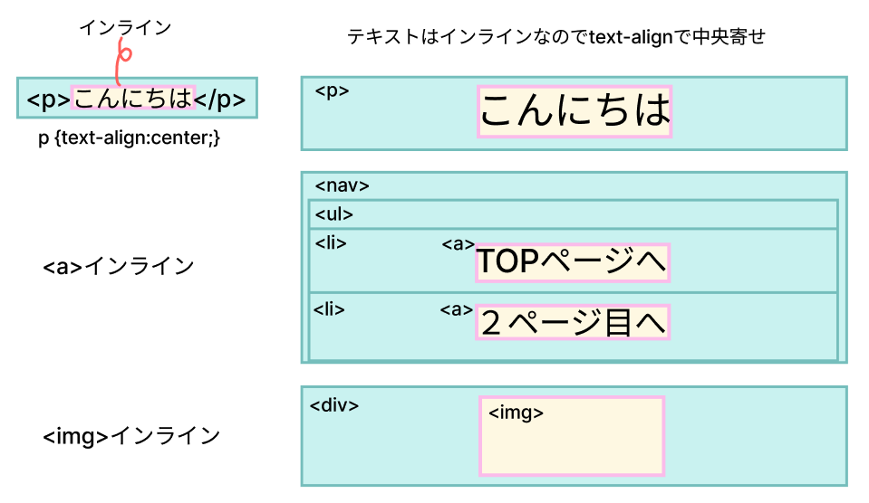

<br>

### **③ 傍線（text-decoration）**

<br>

- `<a>`に初期値でついている下線を消す

```css

text-decoration:none;

```

```css

text-decoration: underline solid #86e6f3 2px;
text-decoration: underline double #86e6f3 2px;
text-decoration: underline dotted #86e6f3 2px;
text-decoration: underline dashed #86e6f3 2px;
text-decoration: underline wavy #86e6f3 2px;

text-decoration: overline solid #86e6f3 2px;
text-decoration: line-through solid #86e6f3 2px;

```

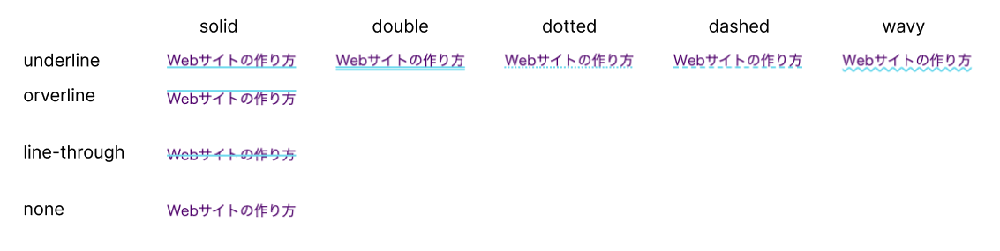

<br>

**`<span>`などで囲んだテキストの装飾にも使えます**

<br><br>

### **【演習①（style.css）】**


### **ナビゲーションを完成させよう**

下のコードを追加しよう  
値を変更して画面にどう表示されるか見てみよう

1. 文字のサイズ変更
2. 文字の配置変更
3. 文字の装飾変更

```css

/* 省略 */

h1{
    color: #7b00b8;
    font-size: 2.3rem;  /* ①追加 */
}

nav {
    background-color: #0bd;
    text-align: center;  /* ②追加 */
}

/* ③追加 */
nav ul li a {
    color: white;
    text-decoration: none;
}

/* 省略 */


```
<br>

### **【表示】**
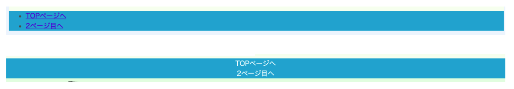


<br><br>

### **2. 子孫セレクタ**

<br>

上の演習で「`nav ul li a`」という書き方がでてきました。  
これは要素の中の要素を指定する書き方で「`<nav>`の中の`<ul>`の中の`<li>`の中の`<a>`」に対してプロパティを指定しています。  

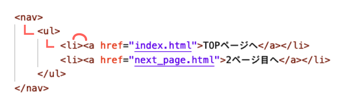

このサイトのHTMLには`<a>`がたくさんありますが、それぞれの`<a>`に違うCSSを適用したいので「子孫セレクタ」を使って区別しています。

<br>

### **【演習②（style.css）】**

<br>

試しに先程書いたコードを書き換えてみよう  

1. 「`nav ul li`」を消して「`a`」だけにするとどうなるだろう

```css

a {
    color: white;
    text-decoration: none;
}

```

全ての「`a`」が白色になってしまいました  

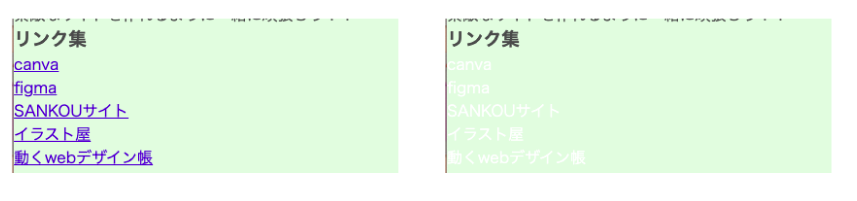

<br><br>

### **3. ボックスモデル**

<br>

要素が四角い箱（領域）に入っています。  
この領域を構成するCSSのプロパティを確認しましょう。

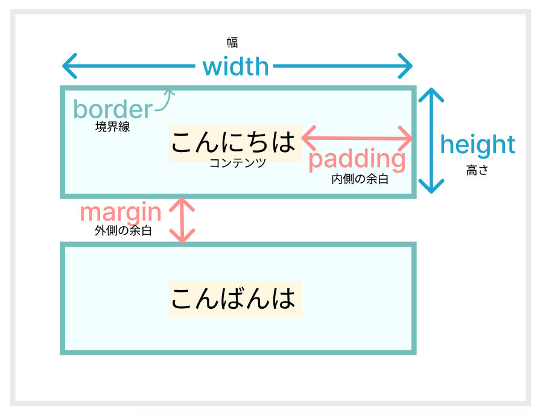

<br>

### **`ボックスモデル`をもとにプロパティの意味を考えるとイメージしやすくなります！！**

<br>

### **4. ボックス特性の変更（display）**

<br>

- インラインボックス↔️ブロックボックスの変更
  
```css

display:inline;
display:block;
display:inline-block;

```

<br>

### 【復習】**ブロックボックスとインラインボックスのイメージ**

<br>

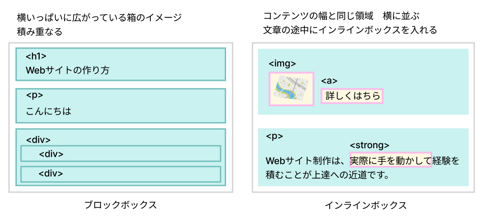

<br>

### **ブロックをインラインに変更**

<br>

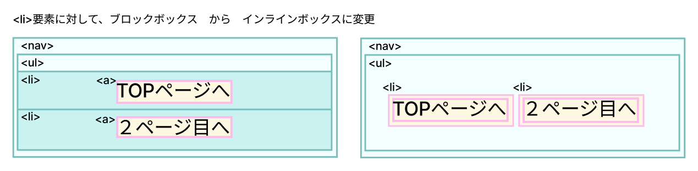

<br>

### **【演習③（style.css）】**

<br>

下のコードを追加しよう  
`コードを入れる場所はHTMLタグの外側から内側に順番に書くことを意識しましょう`

<br>

```css

nav {
    background-color: #0bd;
    text-align: center;
}

/* 追加 */
nav ul li {
    display: inline;
}
/* 追加 */

nav ul li a {
    color: white;
    text-decoration: none;
}


```

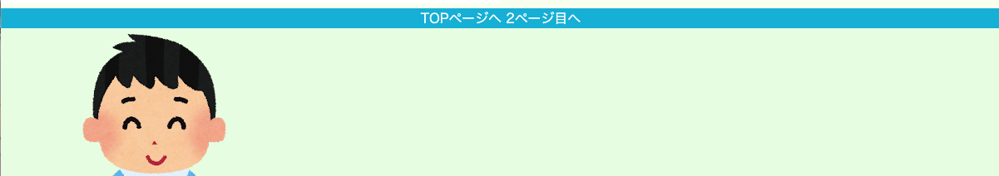

`<li>`がコンテンツと同じ領域になったことで、横並びになりました

<br>

### **5. 余白（paddingとmargin）**

<br>

内側の余白と外側の余白をつけよう

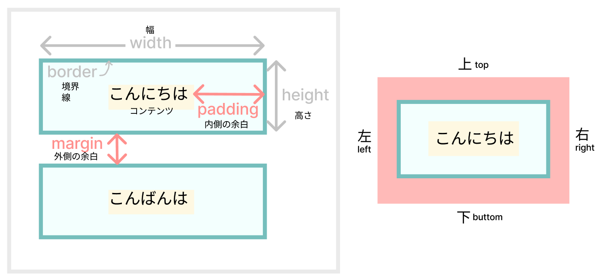

### **内側の余白**

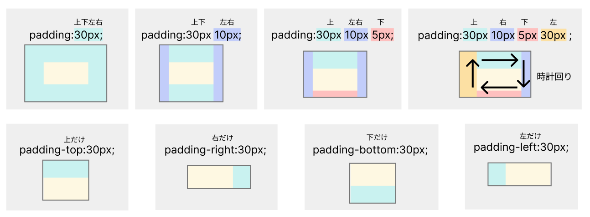

### **外側の余白**

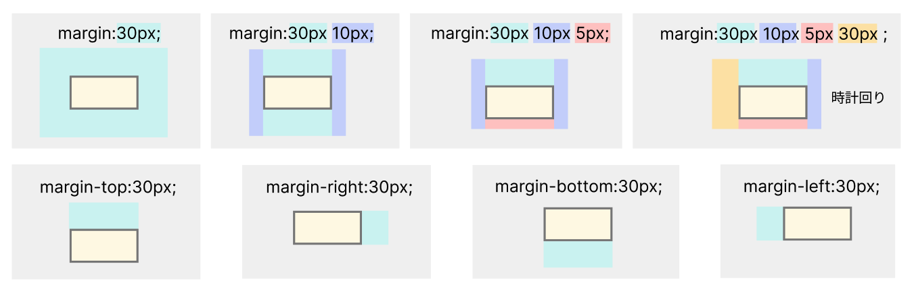

### **paddingとmarginを使ったイメージ**

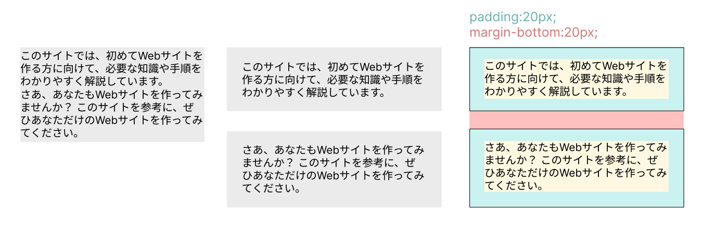

<br>

### **【演習③（style.css）】**

<br>

下のコードを追加しよう  
値を変更して画面にどう表示されるか見てみよう

```css

nav {
    background-color: #0bd;
    text-align: center;
}

/* 追加 */
nav ul {
    padding: 1rem 0;    /* 上下に1rem=16px 左右には入れない */
}
/* 追加 */

nav ul li {
    display: inline;
}

nav ul li a {
    color: white;
    text-decoration: none;
    padding: 1rem 4rem; /* 追加 */    /* 上下に1rem=16px 左右に4rem */
}

```


**余白のイメージ**  
水色の部分がリンクになっている  
文字の上だけでなくpaddingを指定することでリンクの範囲を広げることができます  

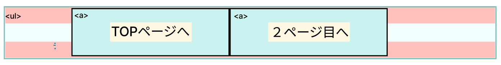
<br><br>
