# **10 メインコンテンツの装飾**

## **この単元でやること**

1. 幅と高さの指定
2. widthとmarginで中央に揃える
  
【演習】メインコンテンツのサイズを調整しよう

<br>

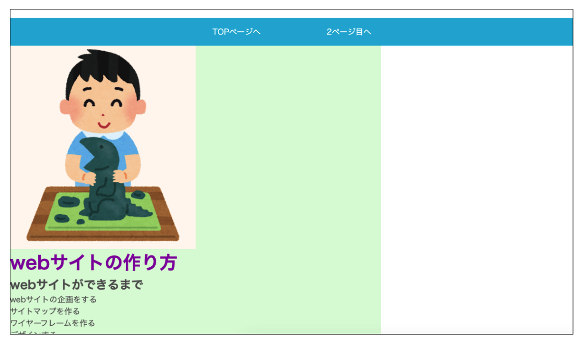
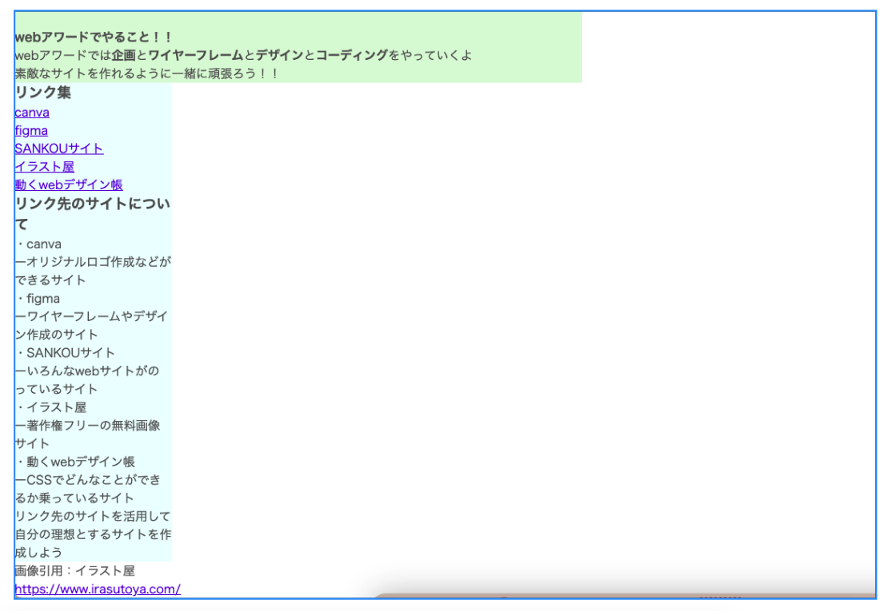

<br><br>

### **この単元で使用するプロパティ一覧**

|  プロパティ  |  意味  | 説明  | 参考書  |
| :---- | :---- | ---- | ---- |
|  `width`  |  幅の指定  |    | 107-109 |
|  `height`  |  高さの指定  |    | 〃 |
|  `px`  |  絶対単位  |  画面上の点を表す単位  |  |
|  `%`  |  相対単位  |  親要素の幅または高さに対する比率でサイズを指定  |  |
|  `em`  |  相対単位  |  親要素のフォントサイズに対する比率でサイズを指定  |  |
|  `rem`  |  相対単位  |  ルートフォントサイズに対する比率でサイズを指定  |  |
|  `vh`  |  相対単位  |  ビューポートの高さを100%としたときの1%を表す  |  |
|  `vw`  |  相対単位  |  ビューポートの幅を100%としたときの1%を表す  |  |

<br><br>

### **1. 幅と高さの指定（width、height）**

<br>

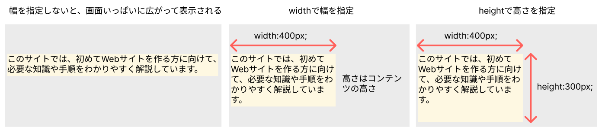

<br>

### **①絶対単位（px）で指定**

pxは画面上の点を表す単位  
他の要素に影響されることなく指定したサイズ  
例えば400pxで幅を指定したら、ブラウザの大きさを変更しても常に同じ幅で表示される

<br>

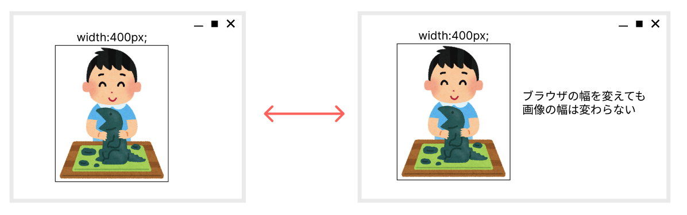


### **②相対単位(%,em,rem,vw,vh)で指定**

要素に対する比率でサイズを指定  
他の要素のサイズに依存する  

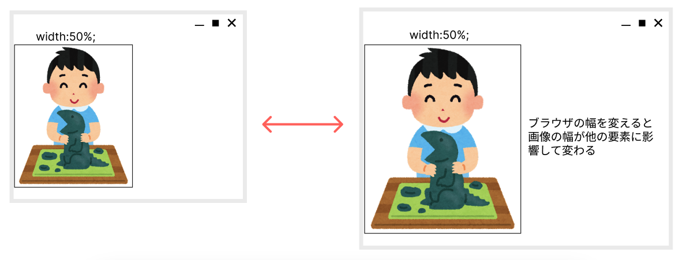

|  単位  |　 説明  |
| :---- | :---- |
|  `%`  |  親要素の幅または高さに対する比率でサイズを指定  |
|  `em`  |  親要素のフォントサイズに対する比率でサイズを指定<br>親要素に指定がない場合は16px  |
|  `rem`  |  ルートフォントサイズに対する比率でサイズを指定<br>ルートは`<html>`htmlで指定したフォントサイズ<br>指定がない場合は16px  |
|  `vw`  |  ビューポートの高さを100%としたときの1%を表す<br>ブラウザウィンドウの横幅  |
|  `vh`  |  ビューポートの幅を100%としたときの1%を表す<br>ブラウザウィンドウの縦幅  |

<br>

### **③親子関係（相対単位）**

相対単位は親要素との関係に基づいてサイズや位置を決定

<br>

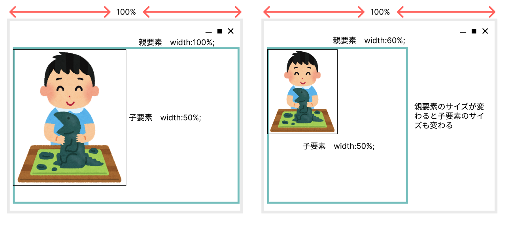

### **`サイズを変更しているのにうまくいかない！！`**
### **`そんなときは親要素のサイズを確認！！`**


<br>


### **【演習①（style.css）】**

1. メインコンテンツとサイドの幅を指定
2. 画像をメインコンテンツの半分の大きさに指定
3. メインコンテンツを中央に表示させる


<br>

### **1.メインコンテンツとサイドの幅を指定**

<br>

最終的にメインコンテンツとサイドを65:18の幅で指定して横に並べます

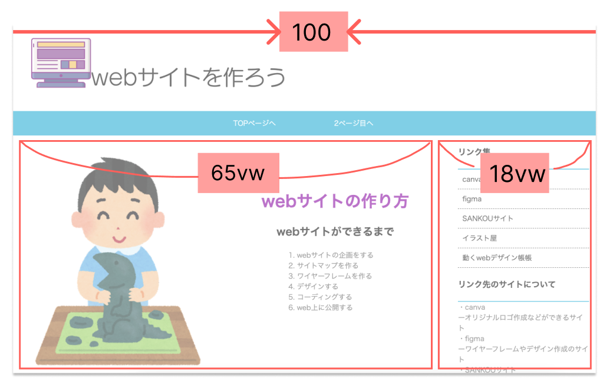

<br>

```css

/*コードの一番下に追加*/

.main_contents {
    width: 65vw;
    background-color: rgb(228, 249, 214); /*背景色は仮で入れる*/
}

section{
    width: 18vw;
    background-color: azure; /*背景色は仮で入れる*/
}

```

<br>

**【結果】**

この時点では横並びにはなっていません  

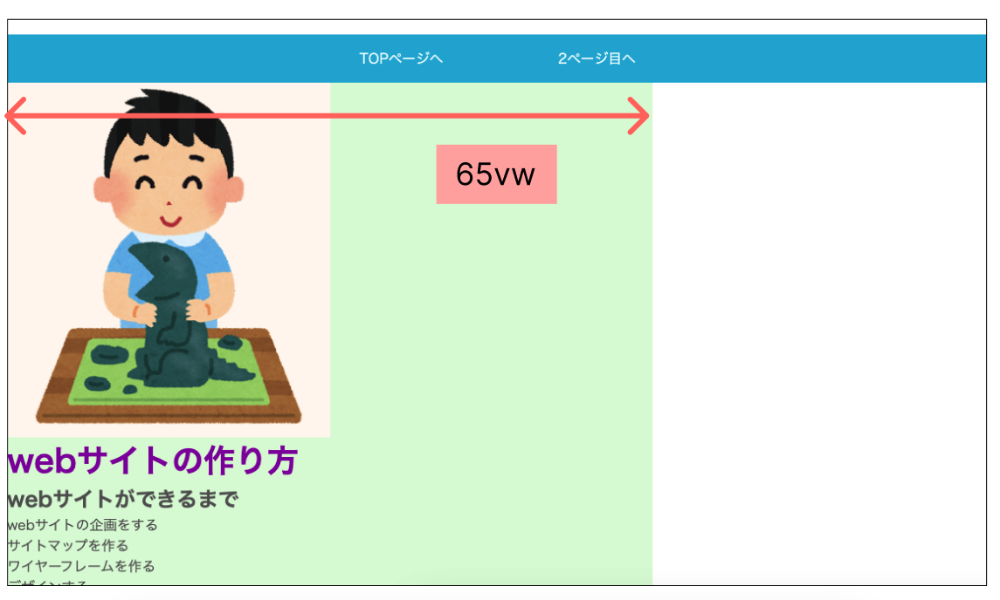
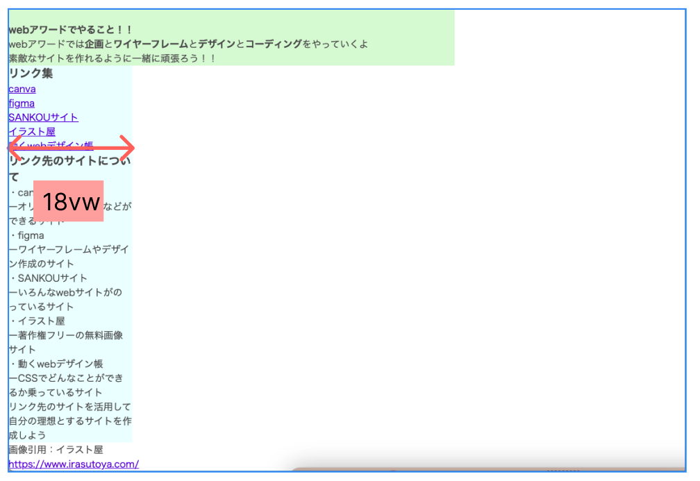

<br>

### **3.画像をメインコンテンツの半分の大きさに指定**


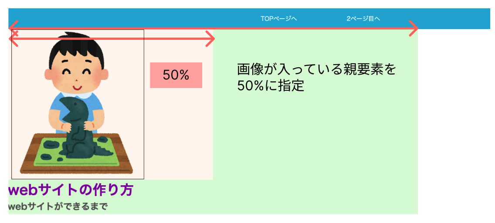
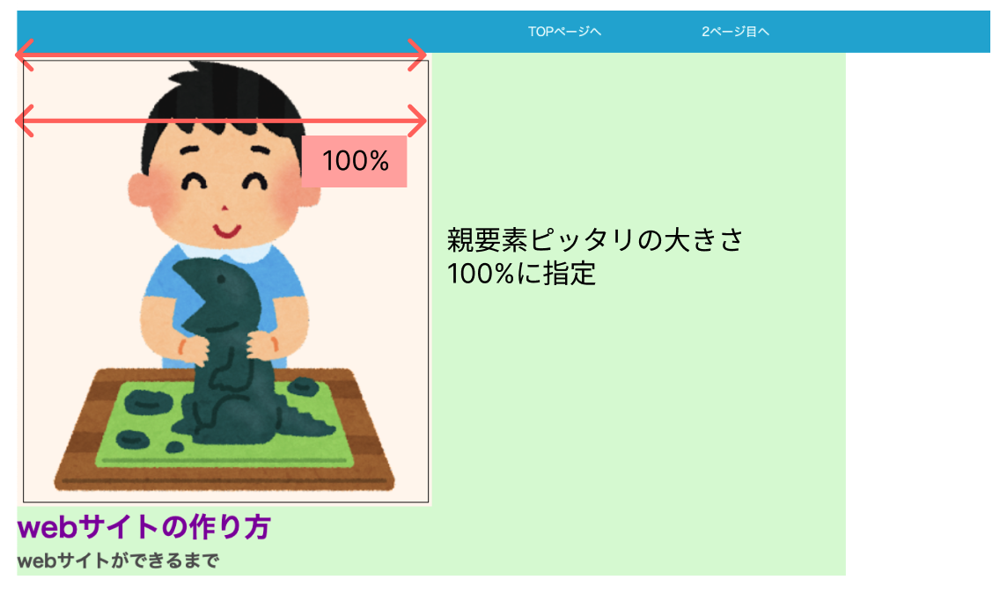

```css

/*コードの一番下に追加*/

.main_visual{
    background-color: rgb(255, 247, 240); /*背景色は仮でいれる*/
    width: 50%;
}

.main_visual img {
    width: 100%;
}

```

<br><br>

### **3. メインコンテンツを中央に表示させる**

widthとmarginを使ってコンテンツを中央に配置する方法  
ブロックボックスは画面いっぱいに領域をとっているので  
左右に余白を入れる余裕がない  
中央に配置したい要素に`width`で幅を指定、`margin:auto`で左右に均等に余白を入れる

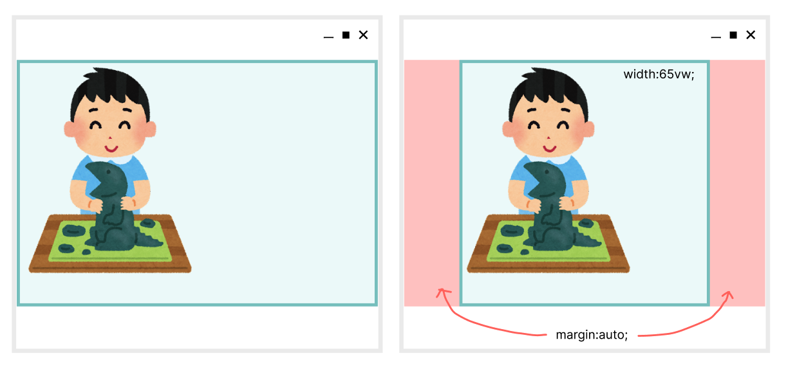

<br>

```css

/*省略*/

.main_contents {
    width: 65vw;
    background-color: rgb(228, 249, 214);
    margin:auto;    /*追加*/
}

section{
    width: 18vw;
    background-color: azure;
}

```

**【結果】**

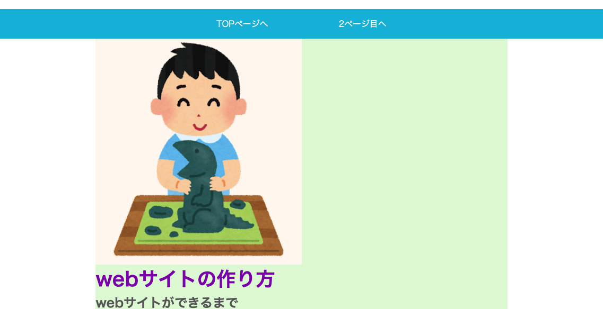

<br>
