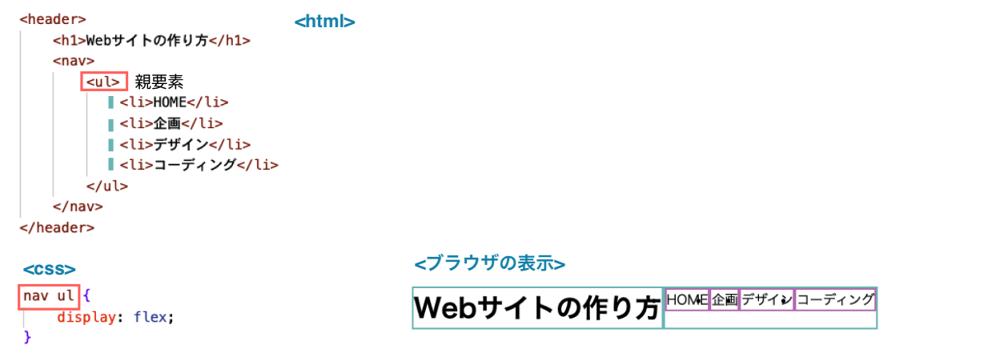

# **11 メインコンテンツのレイアウト**

## **この単元でやること**

1. フレックスボックス
  
【演習】メインコンテンツのレイアウトを調整しよう

<br>


<br><br>

### **この単元で使用するプロパティ一覧**

|  プロパティ  |  意味  | 説明  | 参考書  |
| :---- | :---- | ---- | ---- |
|  `display:flex;`  |  フレックスボックス  |    | 127-128 |
|  `justify-content`  |  アイテムの表示位置を指定<br>余白を自動で調整してくる　  |  flex-start（初期値）<br>flex-end（右寄せ）<br>center（中央寄せ）<br>space-between（両端寄せ中央配置）<br>space-around（均等配置）<br>space-evenly（子要素の半分のサイズで均等配置）  |  |
|  `flex-wrap`  |  アイテムの折り返しの指定  |  nowrap（初期値）<br>wrap（折り返す）<br>wrap-reverse（逆向きに折り返す）  |  |
|  `flex-direction`  |  子要素の並ぶ向き  |  row（初期値）<br>row-reverse（右から左）<br>column（上から下）<br>column-reverse（下から上）  |  |
|  `align-items`  |  垂直方向の揃え<br>flex-directionの向きに対して垂直  |  stretch（初期値）<br>flex-start（上寄せ/左寄せ）<br>flex-end（下寄せ/右寄せ）<br>center（中央配置）<br>baseline（コンテンツの下に合わせる）  |  |


<br><br>

### **1. フレックスボックス**

要素を横並びにするときに使う

<br>


### **コード例①**

**`<div class="content">`の中の子要素`div`を横並び**


### **コード例②** 

**`<header>`の中の子要素`<h1>`と`<nav>`を横並び**


**さらに、`<ul>`の中の子要素`<li>`を横並び** 



<br>

### **flexとセットで使うプロパティ**

### **①横方向の配置（justify-content）**
アイテムの表示位置を指定　余白を自動で調整してくるので便利

```css

.content {
    display: flex;
    justify-content: center;
}

```


### **②折り返しの指定（flex-wrap）**

アイテムの幅を変えずに横並びさせたい時に便利

```css

.content {
    display: flex;
    flex-wrap: wrap;
}

```


### **③子要素の並ぶ向き（flex-direction）**

```css

.content {
    display: flex;
    flex-direction: row-reverse;
}

```


### **④垂直方向の揃え（align-items）**

フレックスコンテナに高さがある場合、垂直方向に中央揃えするときに便利

```css

display: flex;
align-items: center;

```


そのほかにもいろいろなプロパティがあります  
https://www.webcreatorbox.com/tech/css-flexbox-cheat-sheet#flexbox14


### **【演習①（style.css）】**

<br>

### **横並びにしよう**

画像とWebサイトの作り方のコンテンツを横並びにしよう  
まずは、正解を見ずに考えてみよう！！！　　

**ヒント**
- 横並びにしたい要素はどれ
- 親要素を探そう
- display:flex;

<br>


```css

/* 省略 */
.main_contents {
    background-color: rgb(228, 249, 214);
    width: 65vw;
}

/* 追加 ここから*/
.main_top {
    display: flex;
}
/* 追加 ここまで*/

.main_visual{
    background-color: rgb(255, 247, 240);
    width: 50%;
}
/* 省略 */

```

**【結果】**

<br>


<br>

### **【演習②（style.css）】**

「Webサイトの作り方」の部分を中央揃えにしよう  


### **フレックスボックスを使って中央揃えにする方法**

```css

/*省略*/
.main_visual img {
    width: 100%;
}

/*追加　ここから*/
.process {
    display: flex;
    flex-direction: column;
    align-items: center;
}
/*追加　ここまで*/

```

