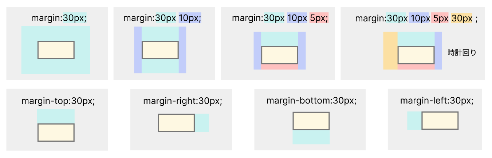

# **12 メインコンテンツのレイアウト**

## **この単元でやること**

1. marginで余白の調整
2. 同じスタイルを指定
  
【演習】メインコンテンツのレイアウトを調整しよう

<br>


<br><br>

### **1. 余白でレイアウト調整**

marginを使ってレイアウトを調整しよう

<br>

**復習**



### **【演習①（style.css）】**

1. ヘッダーイメージの左側の余白
2. 「webサイトの作り方」の上と左の余白
   
<br>

**ヘッダーイメージの左側の余白**

```css

/* 省略 */
h1{
    color: #7b00b8;
    font-size: 2.3rem;
}

/* 追加 ここから*/
header img {
    margin-left: 5vw;
}
/* 追加 ここまで*/

nav {
    background-color: #0bd;
    text-align: center;
}

/* 省略 */

```

**「webサイトの作り方」の上と左の余白**

```css

/* 省略 */
.process {
    display: flex;
    align-items: center;
    flex-direction: column;
}

/* 追加 ここから*/
h1, .process {
    margin-left: 7vw;
}

.web_process {
    margin-top: 10vh;
}
/* 追加 ここまで*/

```
<br><br>

### **2. 複数の要素に同じスタイルを指定**

<br>

上の演習で「`h1, .process`」という書き方が出てきました。  
これは複数の要素に対して同一のスタイルをつけるときの書き方です。  
`h1`と`.process`に「`margin-left: 7vw;`」を適用させるという意味になります。

<br>

