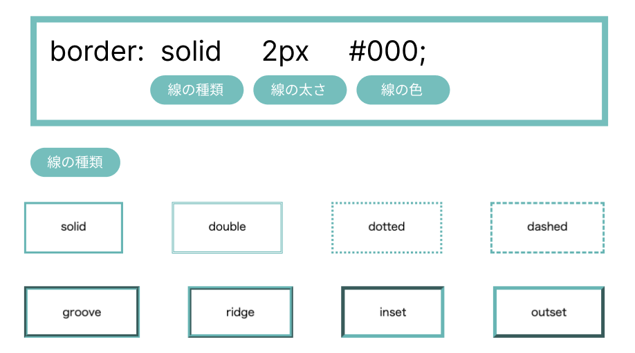

# **13 メインコンテンツのレイアウト**

## **この単元でやること**

1. 枠線を入れる
2. 行間を広げる
3. グリッドレイアウト
  
【演習】メインコンテンツのレイアウトを調整しよう

<br>


### **この単元で使用するプロパティ一覧**

|  プロパティ  |  意味  | 説明  | 参考書  |
| :---- | :---- | ---- | ---- |
|  `border`  |  枠線  |  線の種類　線の太さ　線の色で指定  | 104-106 |
|  `border-radius`  |  角を丸める  |  %、px指定で丸めかたが異なる  | 130-132 |
|  `display:grid;`  |  グリットレイアウトを指定  |    | - |
|  `grid-template-columns`  |  グリッドの横幅と横方向の数を指定  |    | - |
|  `grid-template-rows`  |  グリッドの高さと縦方向の数を指定  |    | - |
|  `gap`  |  グリッド間の隙間  |    | - |
|  `line-height`  |  行間の高さ  |    | 99 |
<br><br>

### **1. 線を入れる**

<br>

### **①枠線**

```css

border:solid 2px #000;

```



<br>

### **②角を丸める**

```css

border-radius: 20%;
border-radius: 50%;
border-radius: 50px;

```


<br><br>

### **2. 行間を広げる**

行間が狭いと読みにくいので行間を広げる  
`<p>`の中で文字と文字の間に隙間を入れたいときに便利です。

```css

line-height: 1.7;
line-height: 2.5;

```


<br><br>

### **3. グリッドレイアウト**

タイル型に自由に要素を配置できるレイアウト

<br>


### **サイズをpxで指定**


<br>

### **サイズを比率で指定**


<br><br>

### **【演習（style.css）】**

1. 枠線をつける
2. 画像の調整
3. 行間を広げる
4. グリッドレイアウトを使ってコンテンツをタイル型にする
   
<br>

**1. 枠線をつける**  


```css

/* 省略 */
.web_process {
    margin-top: 10vh;
}

/* 追加　ここから */
.container {
    border: solid 1px black;
    border-radius: 20px;
}
/* 追加　ここまで */

```

<br>

**2. 画像の調整**

<br>

```css

.container img {
    width: 30%;
}

```

**3. 行間の調整**

<br>

```css

.container p{
    line-height: 1.7;
}

```


<br>

**4. グリッドレイアウトを使ってコンテンツをタイル型にする**

```css

/* 省略 */

.contents {
    display: grid;
    grid-template-columns: 1fr 1fr 1fr;
    gap:10px;
}
```


