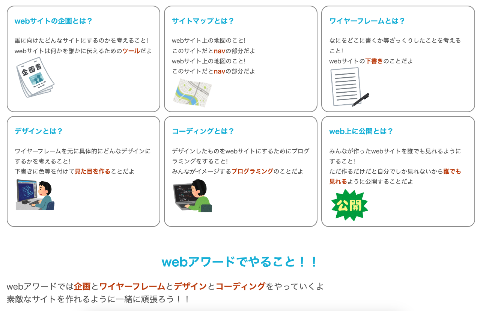
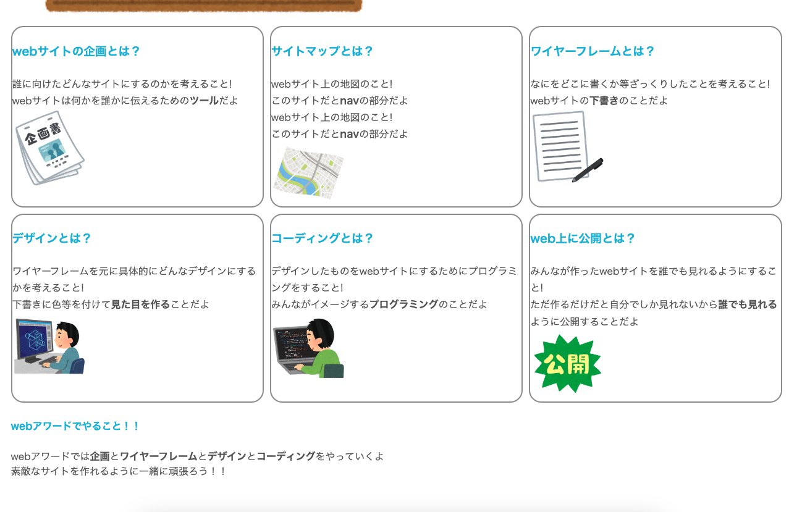
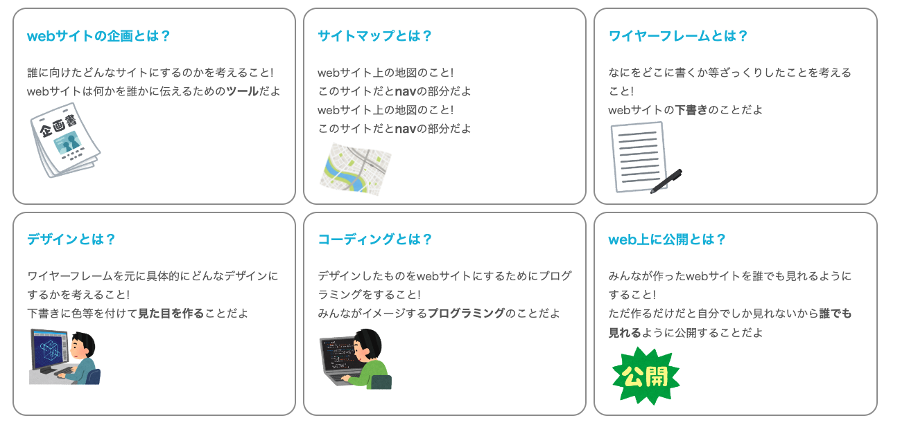
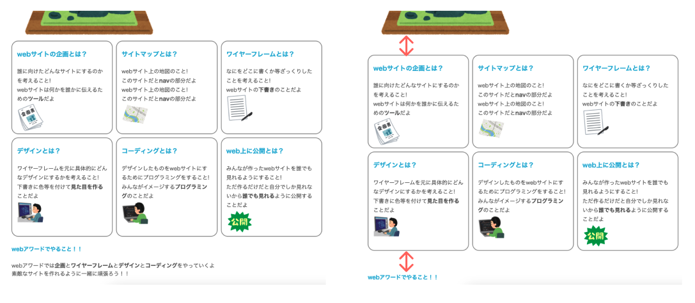
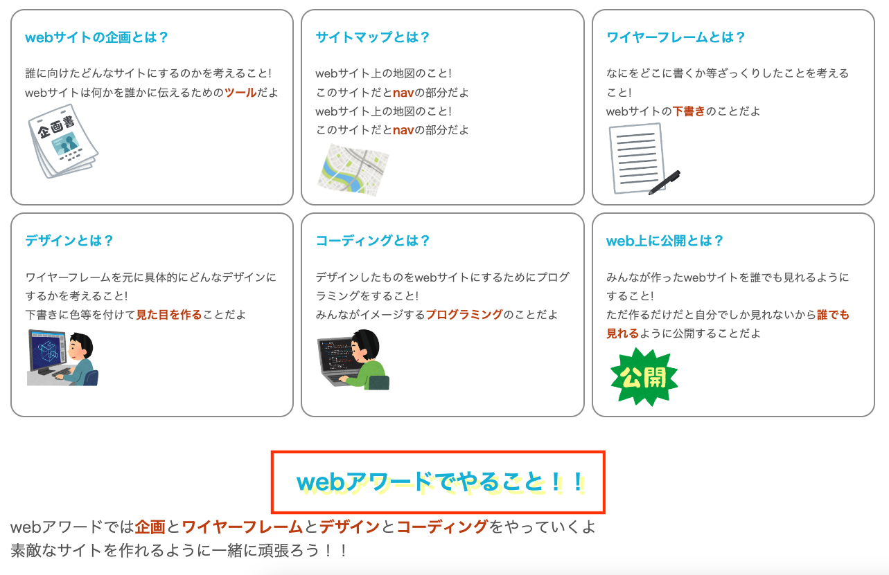

# **14 メインコンテンツのレイアウト**

## **この単元でやること**

1. 細かい部分の余白の調整
2. 色やサイズの調整

【演習】メインコンテンツのレイアウトを調整しよう

<br>



<br>

### **この単元で使用するプロパティ一覧**

|  プロパティ  |  意味  | 説明  | 参考書  |
| :---- | :---- | ---- | ---- |
|  `text-shadow`  |  文字に影をつける  |    | 135 |

<br><br>

細かい部分の調整をしていきます。  
今まで習ったプロパティがたくさんでてきます。思い出しながら書きましょう。

<br>

### **【演習（style.css）】**

### **1. 見出しの調整**

<br>

見出しの色と上下の余白

```css

/*省略*/

h1{
    color: #7b00b8;
    font-size: 2.3rem;
}

/*追加　ここから*/
h2,h3,h4 {
    color: #0bd;
    padding: 3vh 0;
}
/*追加　ここまで*/

header img {
    margin-left: 5vw;
}

/*省略*/

```



<br>

### **2. 枠内の余白**

```css

.container {
    padding-right: 1vw;     /*追加*/
    padding-left: 1vw;     /*追加*/
    border: solid 2px #969696;
    border-radius: 20px;
}

```



<br>

### **3. コンテンツ間の余白**

```css

/*省略*/

nav ul li a {
    color: white;
    text-decoration: none;
    padding: 1rem 4rem;
}

/*追加　ここから*/
.main_top,.contents, .web_award {
    margin-top: 5vh;
    margin-bottom: 5vh;
}
/*追加　ここまで*/

.main_contents {
    width: 65vw;
    margin: auto;
}

/*省略*/

```



<br>

### **4. 文字の装飾**


```css

/*最後に追加*/

.web_award h4{
    text-align: center;
    font-size: 2rem;
    text-shadow:  0.4rem 0.4rem  rgb(255, 252, 162);
}

.web_award p {
    font-size: 1.4rem;
}

strong{
    color: rgb(194, 62, 1);
}

```




<br><br>