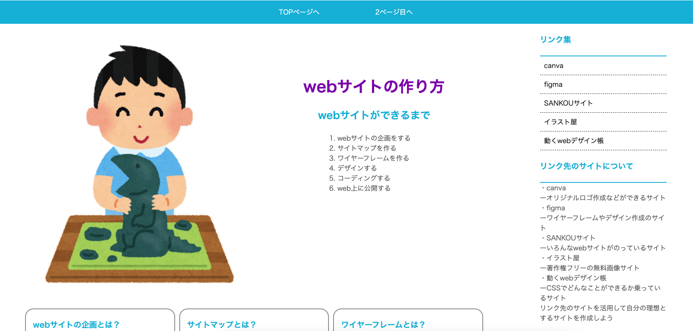
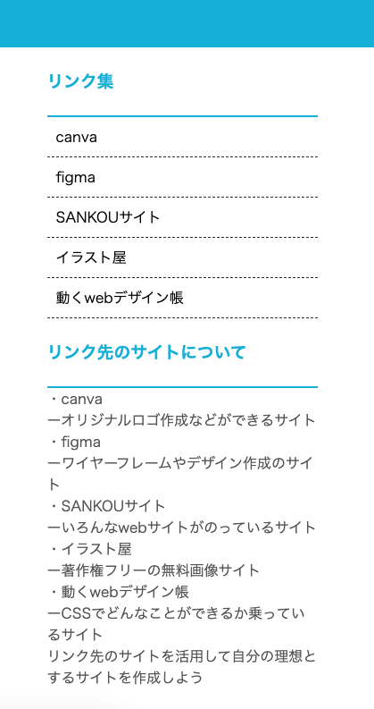

# **15 メインコンテンツとサイドを横並び**

## **この単元でやること**

1. 2カラムレイアウトに変更
2. サイドの装飾

【演習】サイドの装飾

<br>



<br><br>

今まで習ったプロパティがたくさんでてきます。思い出しながら書きましょう。

<br>

### **【演習（style.css）】**

### **1.メインコンテンツとサイドを横並び**

<br>


```css

/*省略*/

.main_top,.contents, .web_award {
    margin-top: 5vh;
    margin-bottom: 5vh;
}

/* 追加　ここから */
.wrapper {
    display: flex;
    justify-content: space-around;
}
/* 追加　ここまで */

.main_contents {
    width: 65vw;
    /* margin: auto; ←ここをコメントアウト*/
}

/*省略*/

```

<br>

### **2.サイドとフッターの装飾**

```css

section ul li {
    list-style: none;
}

section ul li a {
    text-decoration: none;
    color: black;
    display: block;
    padding: 10px;
}

section li {
    border-bottom: 1px dashed #333;
}

.info, .link_set {
    border-bottom: 2px solid #0bd;
} 

footer {
    text-align: center;
    background-color: #0bd;
    color: white;
}
footer p {
    padding: 10px;
}

```

**サイド** 



**フッター** 


<br>
