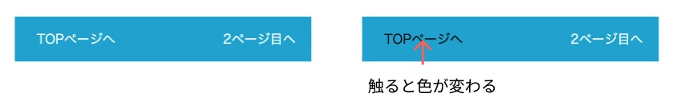
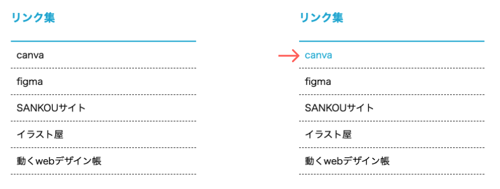

# **16 擬似要素（hover）**

## **この単元でやること**

1. マウスポインタが重なったら変化する
2. transitionアニメーション

【演習】hoverを追加

<br><br>


### **【演習（style.css）】**

### **1.マウスポインタが重なったら変化する**

<br>


```css

/*省略*/

nav ul li a {
    color: white;
    text-decoration: none;
    padding: 1rem 4rem;
}

/* 追加　ここから */
nav a:hover {
    color: black;
    transition: all 0.5s ease-in 100ms;
}
/* 追加　ここまで */

.main_top,.contents, .web_award {
    margin-top: 5vh;
    margin-bottom: 5vh;
}

/*省略*/

```

<br>



<br>

```css

/*省略*/

section li {
    border-bottom: 1px dashed #333;
}

/* 追加　ここから */
section a:hover {
    color: #0bd;
    transition: all 0.5s ease-in 100ms;
}
/* 追加　ここまで */

.info, .link_set {
    border-bottom: 2px solid #0bd;
} 

/*省略*/

```

<br>



<br>

### **transitionアニメーション**  

