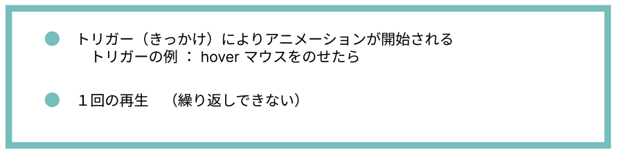
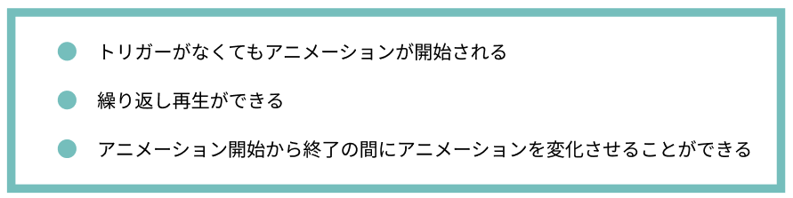
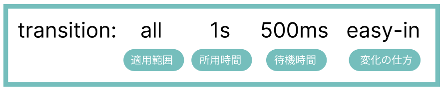
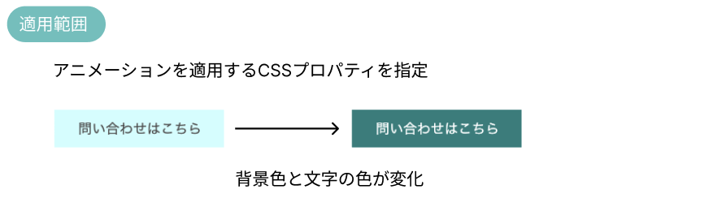
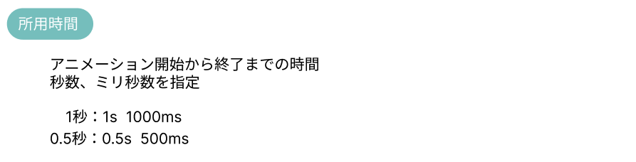
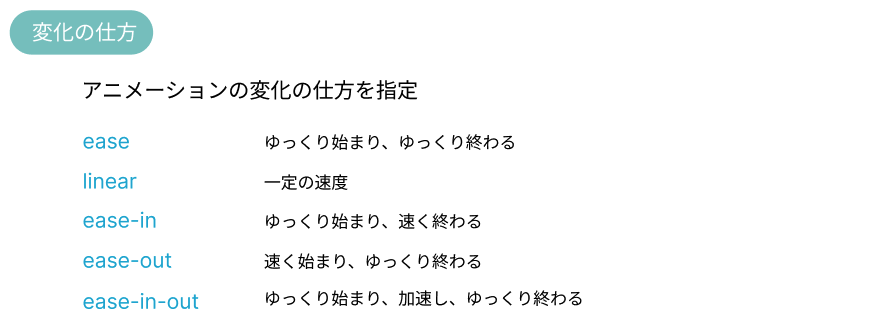

# **16 擬似要素（hover）**

## **この単元でやること**

1. マウスポインタが重なったら変化する
2. アニメーション（transition,animation）

【演習】hoverを追加
【演習】アニメーションを追加

<br><br>


### **1.マウスポインタが重なったら変化する**

### **【演習①（style.css）】**

擬似要素`:hover`をつける

<br>


```css

/*省略*/

nav ul li a {
    color: white;
    text-decoration: none;
    padding: 1rem 4rem;
}

/* 追加　ここから */
nav a:hover {
    color: black;
}
/* 追加　ここまで */

.main_top,.contents, .web_award {
    margin-top: 5vh;
    margin-bottom: 5vh;
}

/*省略*/

```

<br>


<br>

```css

/*省略*/

section li {
    border-bottom: 1px dashed #333;
}

/* 追加　ここから */
section a:hover {
    color: #0bd;
}
/* 追加　ここまで */

.info, .link_set {
    border-bottom: 2px solid #0bd;
} 

/*省略*/

```

<br>


<br>

### **2.CSSアニメーション**  

CSSで表現できるアニメーションは２つ、動きに合わせて使い分けよう  

<br>

**transitonアニメーション**



**animetion @keyframeアニメーション**



<br>

### **①transitonアニメーション**  



「対象」は全てのプロパティ  
「開始から終了までの時間」が１秒間  
「開始まで待つ時間」が0.5秒  
「変化」はゆっくり始まり速く終わる

<br>



`all` 全てのプロパティに適用  

例
```css

a:hover {
    background-color: rgb(82, 148, 145);
    color: #fff;
    transition: all 0.5s 100ms ease-in;
}

```

<br>

`プロパティ指定` 一部に適用  
例：`color`だけアニメーションしたい場合 

```css

a:hover {
    background-color: rgb(82, 148, 145);
    color: #fff;
    transition: color 0.5s 100ms ease-in;
}

```
<br>



<br>


<br>




### **【演習②（style.css）】**

値を変更していろいろ試してみよう！  

```css

/*省略*/

nav a:hover {
    color: black;
    transition: all 1s 500ms ease-in;/*追加*/
}

/*省略*/


section a:hover {
    color: #0bd;
    transition: all 1s 500ms ease-in;/*追加*/
}

```
