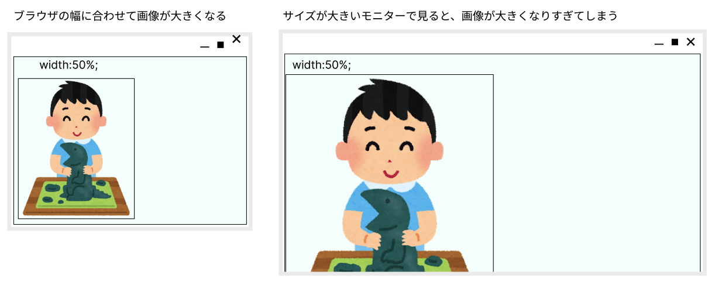
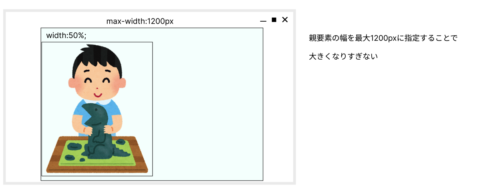
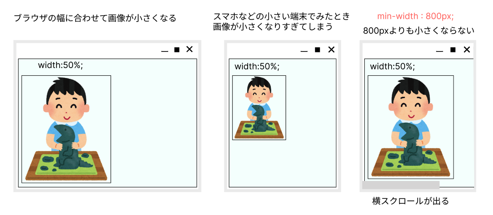

# **17 最大幅最小幅の指定**

## **この単元でやること**

1. 横幅の最大値最小値を指定する

【演習】横幅に最大値最小値を指定する

<br>

### **この単元で使用するプロパティ一覧**

|  プロパティ  |  意味  | 説明  | 参考書  |
| :---- | :---- | ---- | ---- |
|  `max-width`  |  最大幅を指定  |    | 109 |
|  `min-width`  |  最小幅を指定  |    | 109 |

<br>

### **1.最大幅を指定（max-width）**





### **2.最小幅を指定（min-width）**



### **【演習（style.css）】**

### **1.最大幅最小値を指定**

<br>


```css

/*省略*/

.main_contents {
    width: 65vw;
    /* margin:auto; */
    max-width: 1100px;      /*追加*/
    min-width: 800px;       /*追加*/
}

/*省略*/

section {
    width: 18vw;
    min-width: 300px;       /*追加*/
}

```

