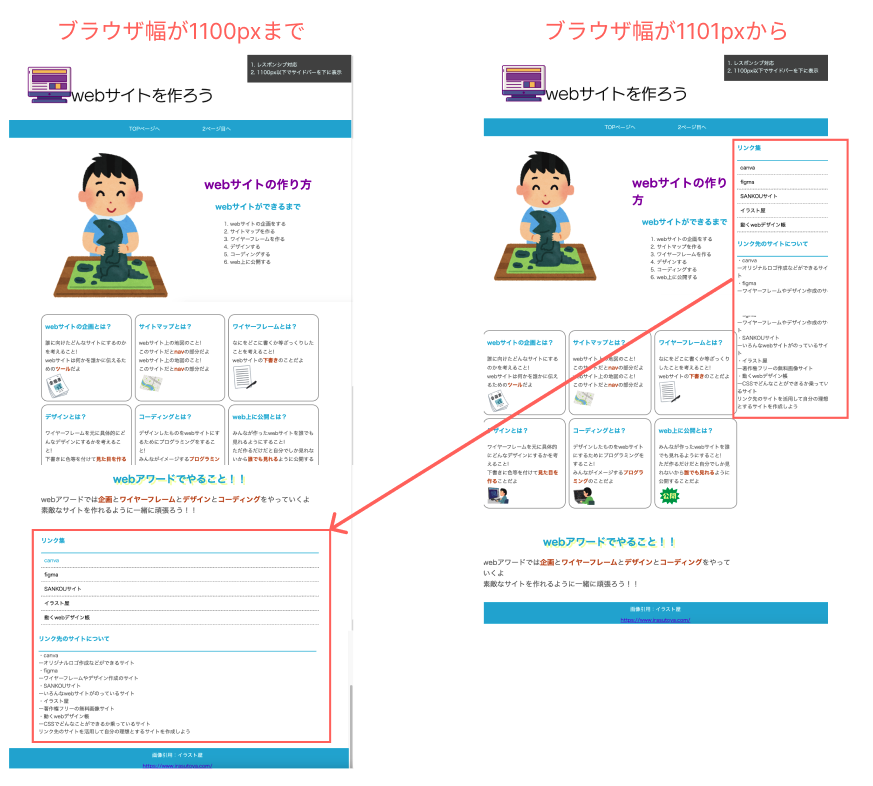

# **18 レスポンシブデザイン**

## **この単元でやること**

1. レスポンシブデザイン

【演習】レスポンシブ対応しよう

<br>


### **レスポンシブデザインとは**

- 閲覧環境によって、サイトのデザインを変えること
- 画面サイズに応じてCSSを切り替える

<br>



### **【演習（index.html）】**

<br>

### **1.ビューポートの指定**


```html

<head>
    <meta charset="UTF-8">
    <title>Webサイトの作り方</title>
    <!-- 追加↓ -->
    <meta name="viewport" content="width=device-width,initial-scale=1">
    <link rel="stylesheet" href="https://unpkg.com/ress/dist/ress.min.css">
    <link rel="stylesheet" href="style.css">
</head>

```

### **2.ブレイクポイントの指定**

<br>


```css

@media (max-width:1100px) {
    .wrapper {
        display: block;
    }

    .main_contents {
        width: 80vw;
        margin: auto;
    }

    section{
        width: 80vw;
        margin: auto;
        margin-bottom: 5vh;
    }
    
}

@media (max-width:640px) {
    .wrapper {
        display: block;
    }

    header img {
        width: 100%;
    }
    
    nav ul li {
        display: block;
    }

    .main_contents {
        width: 80vw;
        min-width: 300px;
        margin: auto;
    }

    .main_top {
        display: block;
    }

    section{
        width: 80vw;
        margin: auto;
        margin-bottom: 5vh;
    }

    .contents {
        display: block;
    }
    
}

```

