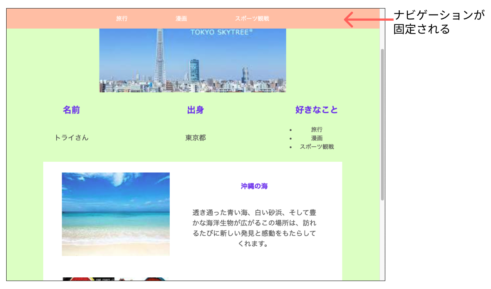
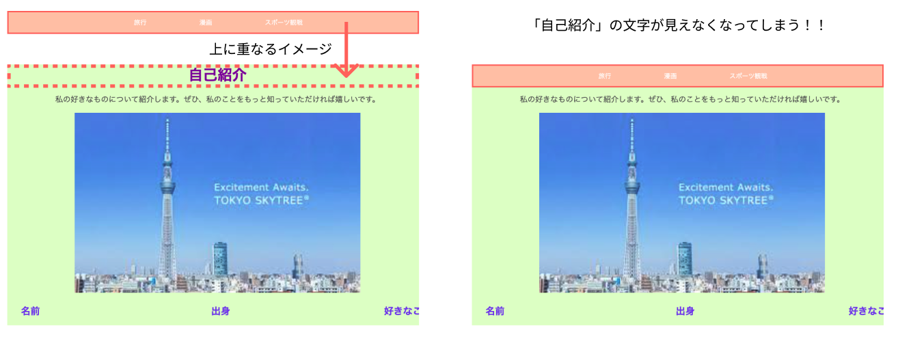
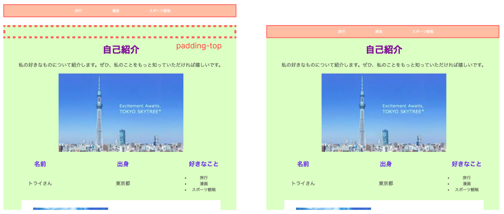
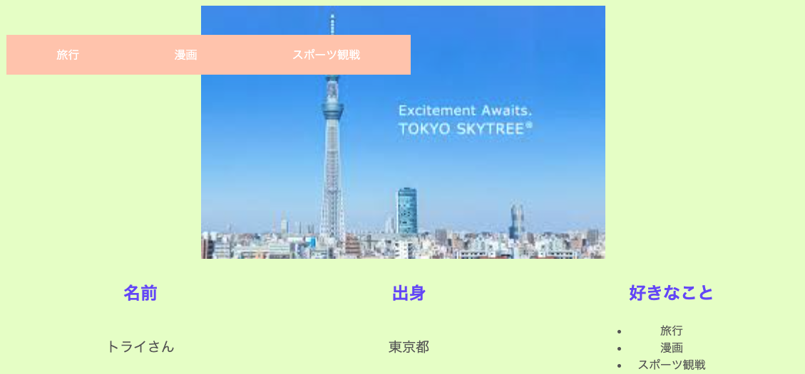
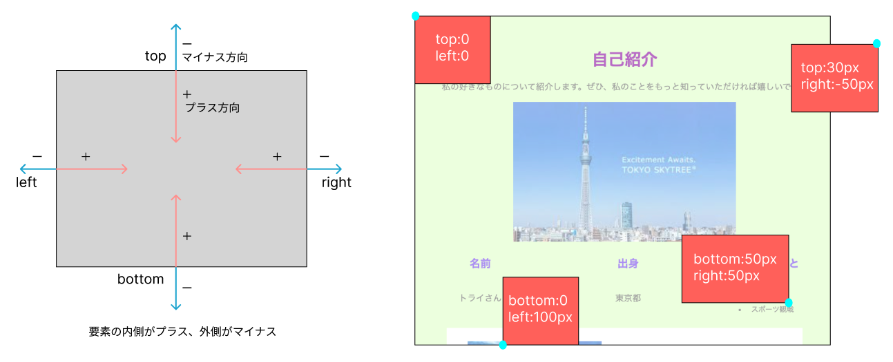

# **要素を固定する**

## **この単元でやること**

1. ナビゲーションを固定する
2. 特定の位置に固定する

### **1. ナビゲーションを固定する**



`position:fixed;`

```css

nav {
    width: 100%;
    background-color: rgb(255, 200, 179);
    text-align: center;
    position: fixed;    //←追加
}

```

### **注意：要素の上に重なって、固定される**



**対処法①**  
CSSで対応  
navの高さ分の隙間（padding）をいれて下にずらしておく

```css

.profile {
    text-align: center;
    background-color: rgb(236, 253, 199);
    padding-top: 70px; /*追加*/
}

```



**対処法②（少し高度）**  
JavaScript(jQuery)  
スクロールするまで固定しない→スクロールしたときに固定する  
JavaScriptを使うと、スクロールの位置情報を取得することができ、スクロールの位置によって要素を固定したり、アニメーションしたりすることができます。

→余裕がある人は先生に相談してやってみよう

【参考】
https://coco-factory.jp/ugokuweb/move01/5-1-5/

### **2. 特定の位置に固定する**  

top,right,left,bottomを指定することで、特定の位置に固定することができる



```css

nav {
    width: 50%;
    background-color: rgb(255, 200, 179);
    text-align: center;
    position: fixed;
    top:50px;
    left:10px;
}

```



### **positionその他の使い方**
`要素の上に要素を重ねる場合もpositionをつかいます`  
例えば、画像の上に文字を重ねる、画像と画像をずらして重ねるなど  
「22_要素を重ねる」を参照してください
