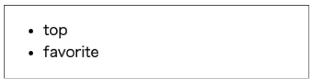
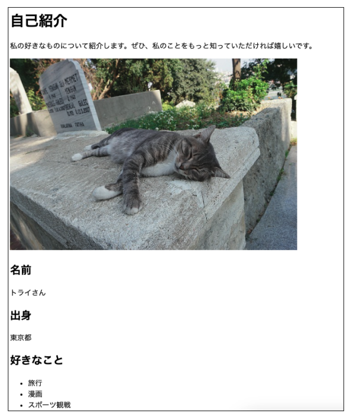
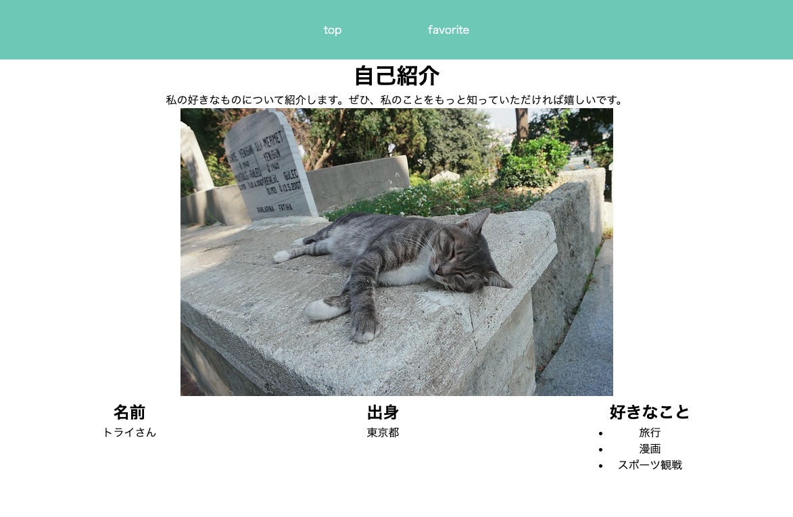

# **自己紹介サイトをつくろう**

演習で制作しているサンプルサイトを参考に自己紹介サイト（２ページ）を作ります  
- １ページ目は下のガイドを見て、演習で習ったことを思い出しながら制作
- ２ページ目は「好きなもの（こと）を紹介する」ページを自由制作


|    |  ガイド①  |  教科書  |
| :---- | :---- | :---- |
| 1 | 「プログラミング」フォルダの中に「自己紹介」フォルダを作成 | 02 |
| 2 | index.html、style.cssファイルを作成 | 02 |
| 3 | index.htmlに基本構造を作る | 03 |
| 4 | グループを作る<br>参考：「ヘッダー」「メイン」のグループを作成 | 03 |
| 5 | ナビゲーションを作る<br>「ヘッダー」にナビゲーションを作る | 04 |

<br>


|    |  ガイド②  |  教科書  |
| :---- | :---- | :---- |
| 6 | 見出しタイトルを追加 | 05 |
| 7 | 画像を追加 | 06 |
| 8 | 基本情報を追加（見出し、本文、リストなど） | 06 |

<br>


|    |  ガイド③  |  教科書  |
| :---- | :---- | :---- |
| 9 | cssのリンクを追加 | 08 |
| 10 | リセットcss追加 | 08 |
| 11 | ナビゲーションの装飾<br>※一般的な作り方を思い出そう | 09 |
| 12 | 背景色や文字色の変更 | 09 |
| 13 | サイズの変更 | 10 |
| 14 | 余白の追加<br>※コンテンツとコンテンツの間に余白を入れて見やすくしよう | 09,12 |
| 15 | 配置の変更<br>※横並びの配置にしてみよう | 11 |
| 16 | ２ページ目を作る<br>自由につくろう<br>`figmaを使ってワイヤーフレームを作ろう` | 04 |

<br><br><br>

### **ガイド①の例**


### **ガイド②の例**
  

【htmlコード例】

```html

<!DOCTYPE html>
<html lang="ja">
<head>
    <meta charset="UTF-8">
    <title>自己紹介</title>
    <link rel="stylesheet" href="https://unpkg.com/ress/dist/ress.min.css">
    <link rel="stylesheet" href="style.css">
</head>
<body>
    <header>
        <ul>
            <li><a href="index.html">top</a></li>
            <li><a href="favorite.html">favorite</a></li>
        </ul>
    </header>

    <main>
        <h1>自己紹介</h1>
        <p>私の好きなものについて紹介します。ぜひ、私のことをもっと知っていただければ嬉しいです。</p>
        
        <div class="section">
            <div class="content">
                <h2>名前</h2>
                <p>トライさん</p>    
            </div>
            <div class="content">
                <h2>出身</h2>
                <p>東京都</p>
            </div>
            <div class="content">
                <h2>好きなこと</h2>
                <ul>
                    <li>旅行</li>
                    <li>漫画</li>
                    <li>スポーツ観戦</li>
                </ul>    
            </div>
        </div>
    </main>

</body>
</html>

```

### **ガイド③の例**

レイアウトの例です。  
文字の色、背景色、余白、サイズを追加して、自分オリジナルのサイトに書き換えよう

  


【cssコード例】

```css

@charset "UTF-8";

header {
    background-color: rgb(124, 207, 189);
    margin: 0;
}

nav ul {
    display: flex;
    justify-content: center;
    list-style:none;
}

nav ul li {
    padding: 2rem;
}

nav ul li a{
    padding: 2rem;
    text-decoration: none;
    color: #fff;
}

main {
    text-align: center;
}

.section{
    display: flex;
    justify-content: space-around;
}


```
