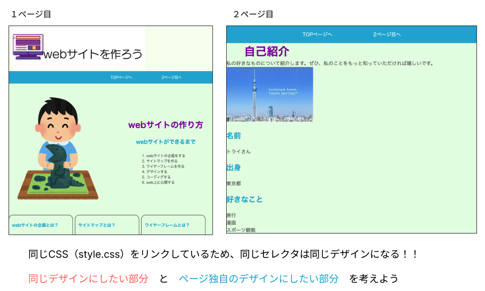
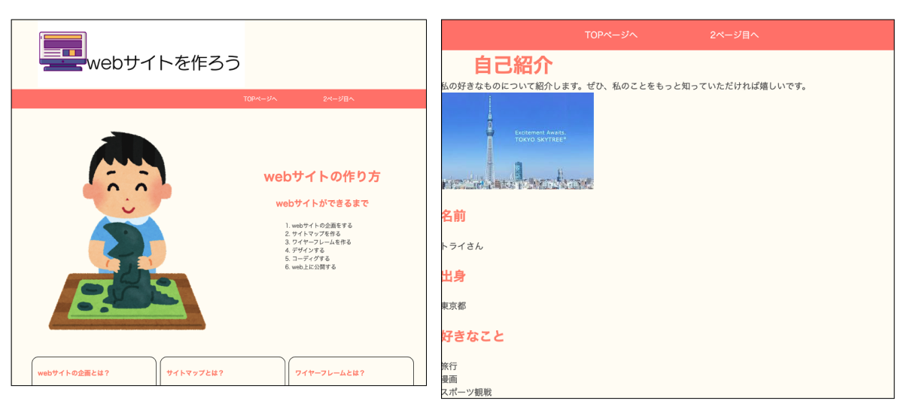
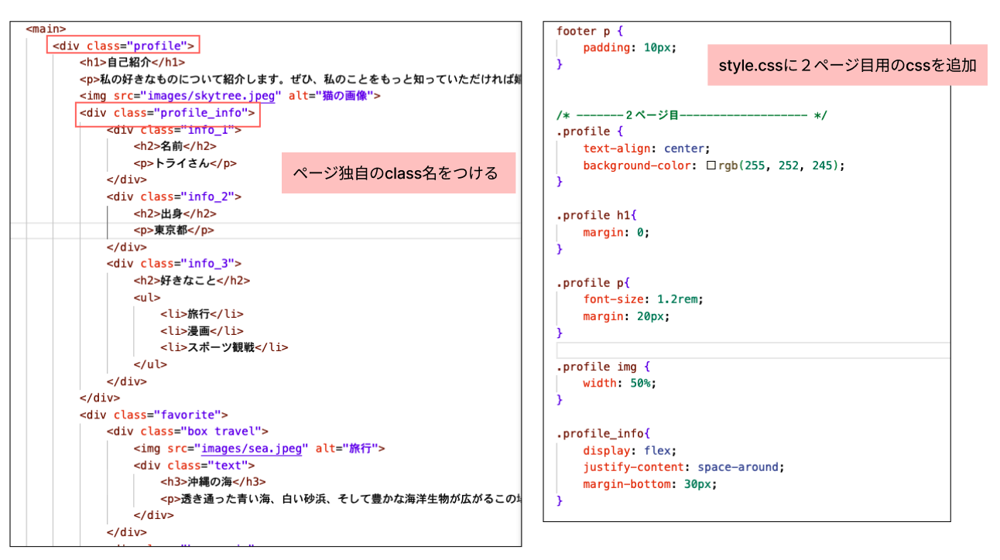
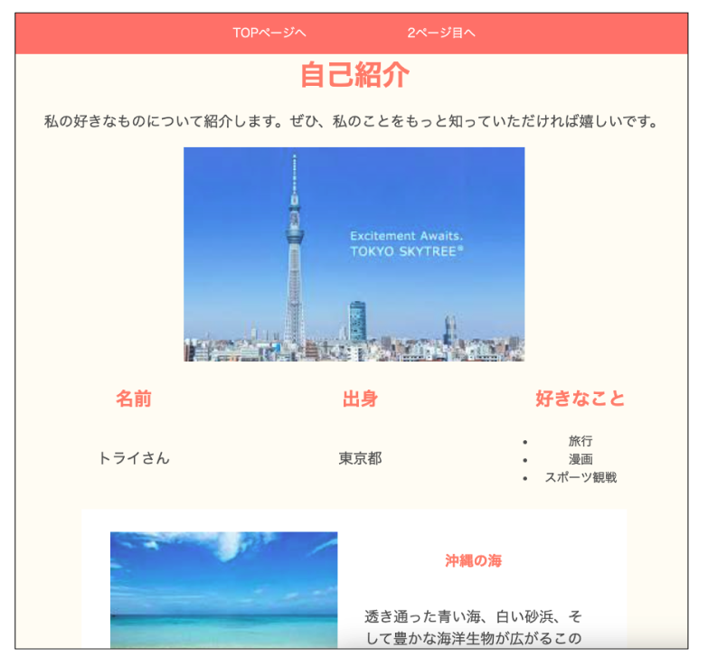

# **オリジナルサイトを作ろう**

## **自己紹介サイトを作ろう**  

- テーマは「好きなもの（こと）を紹介する」ページを自由制作
- 2ページ以上作る 
- 下のガイドに沿って進めましょう

<br><br>

|    |  ガイド①  |  教科書  |
| :---- | :---- | :---- |
| 1 | フォルダを作成 <br> 例：「自己紹介」 | 02 |
| 2 | figmaでレイアウトを考える<br>figmaの使い方に慣れておこう！ | 01 |
| 3 | figmaのレイアウトを元にグループを考える<br>難しい場合は先生にどのようにグループ分けをしたらようか聞いてみよう！ | 03 |
| 4 | １ページ目を作る <br> index.html、style.cssファイル、画像を入れるフォルダ(images)を作成 | 02 |
| 5 | index.htmlに基本構造を作る | 03 |
| 6 | グループを作る<br>例：「ヘッダー」「メイン」「フッター」のグループを作成 | 03 |
| 7 | ナビゲーションを作る<br>１ページと２ページが行き来できるようにリンクを作る | 04 |
| 8 | メインコンテンツのグループを作る | 03 |

<br>


|    |  ガイド②  |  教科書  |
| :---- | :---- | :---- |
| 6 | 見出しタイトルを追加 | 05 |
| 7 | 画像を追加 | 06 |
| 8 | コンテンツ追加（見出し、本文、リストなど） | 06 |

<br>

|    |  ガイド③  |  教科書  |
| :---- | :---- | :---- |
| 9 | cssのリンクを追加 | 08 |
| 10 | リセットcss追加 | 08 |
| 11 | ナビゲーションの装飾<br>※一般的な作り方を思い出そう | 09 |
| 12 | 背景色や文字色の変更 | 09 |
| 13 | サイズの変更 | 10 |
| 14 | 余白の追加<br>※コンテンツとコンテンツの間に余白を入れて見やすくしよう | 09,12 |
| 15 | 配置の変更<br>※横並びの配置にしてみよう | 11 |
| 16 | ２ページ目を作る　index.htmlからコピー　共通部分以外を削除 | 04 |

<br><br><br>

下に参考サイトとコード例を載せています。  
レイアウトを考えるのが難しい、何を書いて良いかわからない場合は先生に相談して参考にしてもよいです。  

https://programing-course.github.io/website/profile

**【コード例（１ページ目のhtml）】**

```html
<!DOCTYPE html>
<html lang="ja">

<head>
    <meta charset="UTF-8">
    <title>自己紹介</title>
    <meta name="viewport" content="width=device-width,initial-scale=1">
    <link rel="stylesheet" href="https://unpkg.com/ress/dist/ress.min.css">
    <link rel="stylesheet" href="style.css">
</head>

<body>
    <header>
        <nav>
            <ul>
                <li><a href="index.html">HOME</a></li>
                <li><a href="like.html">好きなもの</a></li>
            </ul>
        </nav>
    </header>
    <main>
        <div class="profile">
            <h1>自己紹介</h1>
            <p>私の好きなものについて紹介します。<br>ぜひ、私のことをもっと知っていただければ嬉しいです。</p>
            
            <div class="profile_info">
                <div class="info_1">
                    <h2>名前</h2>
                    <p>トライさん</p>    
                </div>
                <div class="info_2">
                    <h2>出身</h2>
                    <p>東京都</p>
                </div>
                <div class="info_3">
                    <h2>好きなこと</h2>
                    <ul>
                        <li>旅行</li>
                        <li>漫画</li>
                        <li>スポーツ観戦</li>
                    </ul>    
                </div>
            </div>
        </div>
    </main>
</body>

</html>

```

**【コード例（2ページ目のhtml）】**

```html

<!DOCTYPE html>
<html lang="ja">

<head>
    <meta charset="UTF-8">
    <title>自己紹介</title>
    <meta name="viewport" content="width=device-width,initial-scale=1">
    <link rel="stylesheet" href="https://unpkg.com/ress/dist/ress.min.css">
    <link rel="stylesheet" href="style.css">
</head>

<body>
    <header>
        <nav>
            <ul>
                <li><a href="index.html">HOME</a></li>
                <li><a href="like.html">好きなもの</a></li>
            </ul>
        </nav>
    </header>
    <main>
        <div class="like">
            <div class="favorite">
                <div class="box travel">
                    
                    <div class="text">
                        <h2>沖縄の海</h2>
                        <p>透き通った青い海、白い砂浜、そして豊かな海洋生物が広がるこの場所は、訪れるたびに新しい発見と感動をもたらしてくれます。</p>
                    </div>
                </div>
                <div class="box comic">
                    
                    <div class="text">
                        <h2>鬼滅の刃</h2>
                        <p>炭治郎の優しさと強い意志、そして妹を守るために戦う姿勢にはいつも心を打たれます。禰豆子の可愛らしさと力強さも見逃せません。彼らの絆は、どんな困難にも立ち向かう勇気を教えてくれます。</p>
                    </div>
                </div>
                <div class="box sport">
                    
                    <div class="text">
                        <h2>ベイスターズ</h2>
                        <p>球場での熱気、選手たちの活躍、そしてファンとの一体感がたまりません。</p>
                    </div>
                </div>
            </div>
        </div>    
    </main>
</body>

</html>

```

**【コード例（css）】**

```css

@charset "UTF-8";

body{
    color: rgb(95, 95, 95);
}

header{
    background-color: rgb(255, 252, 245);
}

main{
    background-color: rgb(255, 252, 245);
}

footer{
    background-color: rgb(217, 255, 202);
}

h1{
    color: #f694a0;
    font-size: 2.3rem;
}

h2, h3, h4{
    color: #f694a0;
    padding: 3vh 0;
}

nav{
    background-color: rgb(197 234 250);
    text-align: center;
}

nav ul {
    padding: 1rem 0;
}

nav ul li {
    display: inline;
}

nav ul li a {
    color: #f694a0;
    text-decoration: none;
    padding: 1rem 4rem;
}

nav a:hover {
    color:black;
}

.profile {
    text-align: center;
    background-color: rgb(255, 252, 245);
}

.profile p {
    line-height: 2;
    margin: 30px;
}

.profile img{
    width: 80%;
}

.profile_info{
    display: flex;
    justify-content: space-around;
    padding: 50px;
}

/* -------２ページ目------------------- */
.like {
    text-align: center;
    background-color: rgb(255, 255, 255);
}

.favorite {
    width: 80%;
    margin: 50px auto;
}

.box {
    display: flex;
    justify-content: space-around;
    padding: 30px;
    background-color: rgb(255, 253, 240);
    border: solid 5px rgb(197 234 250);
    margin-bottom: 50px;
}

.box img {
    width: 300px;
}

.box p{
    font-size: 1.2rem;
    margin: 20px;
}

.box .text {
    width: 50%;
}

```

<br><br>

### **【考えよう！】共通デザイン　と　ページ独自のデザイン**

例えば、２ページ目を下の画像（右側）の内容でHTMLを書くと  
背景、見出し、文字の色が１ページ目と同じデザイン（色）で表示されます  

 

**【サイト全体の一貫性】**

以下の要素を統一することで、サイト全体の一貫性が保たれます。

- ヘッダー（ロゴ、ナビゲーション）
- フッター
- 色使い（背景色、テキストの色、リンクの色）

他にも文字の種類や配置など、デザインの基本的な考え方がありますが、詳しくは別の単元で説明します。  

**`まずは共通部分のデザインを変更して、全体のイメージを決めよう！`**

 

**【ページオリジナルのデザインにするには？】**

そのページ独自のclass名をつけて、cssを切り分ける  
そのページの内容がわかるような名前をつけておくと、コードを探すときに便利です。  

 


