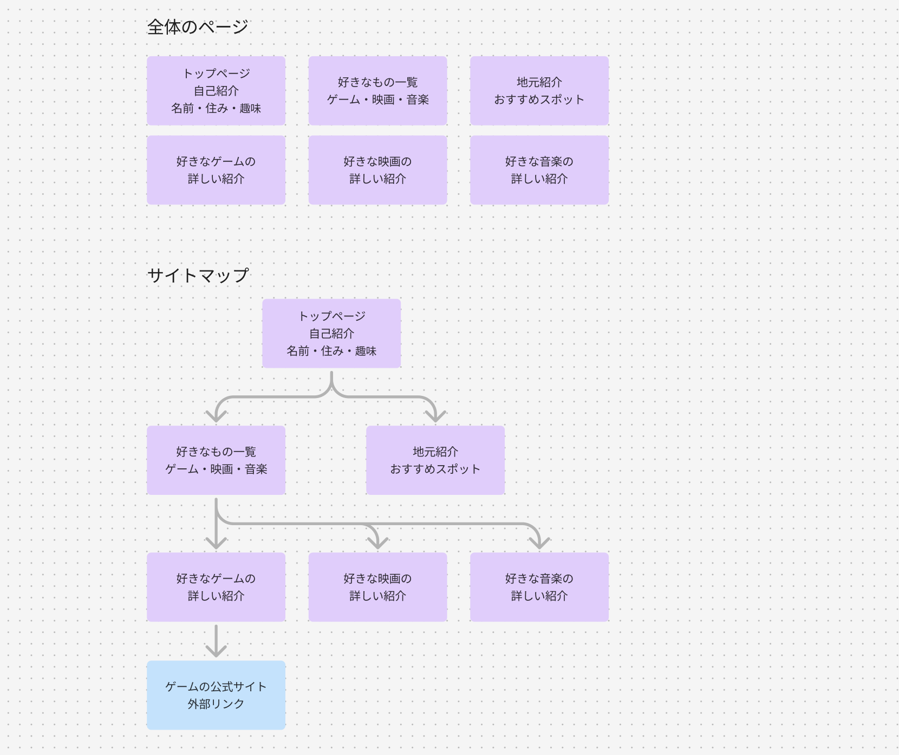
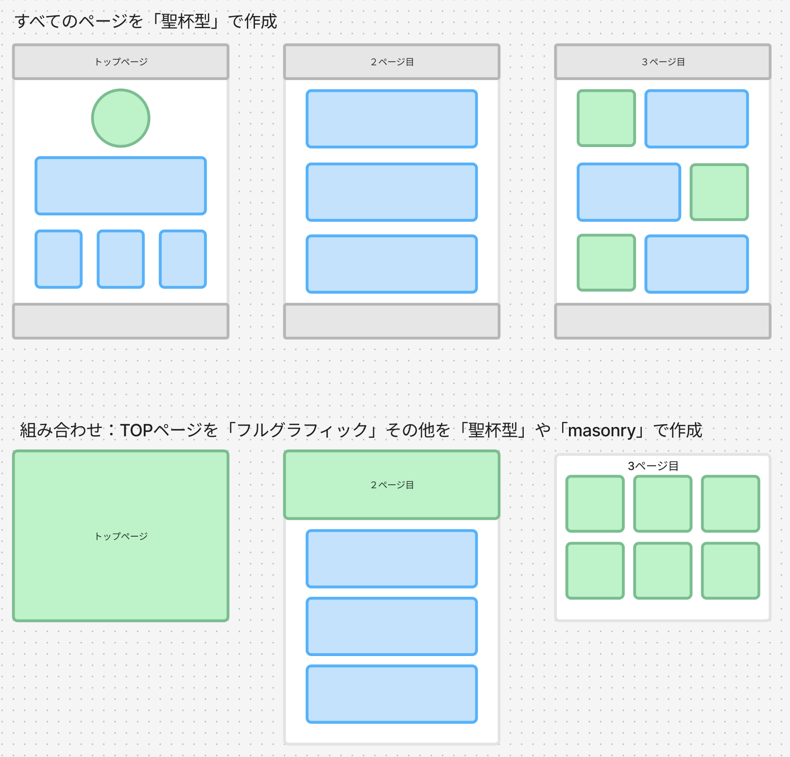
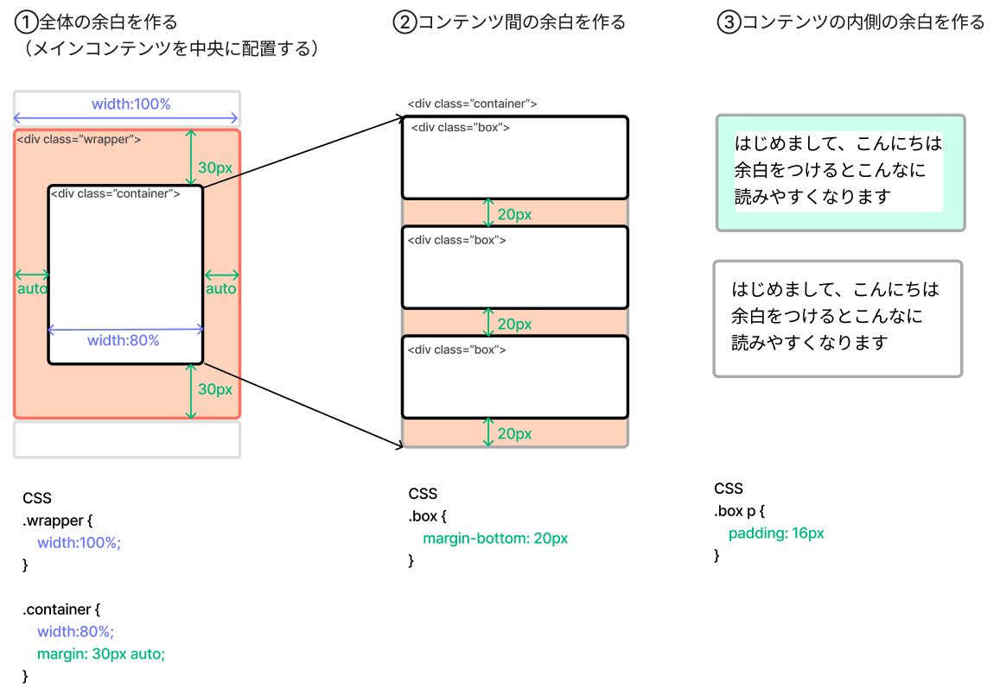
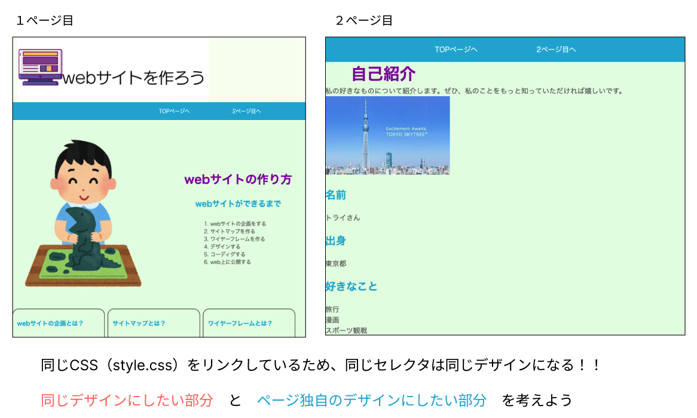
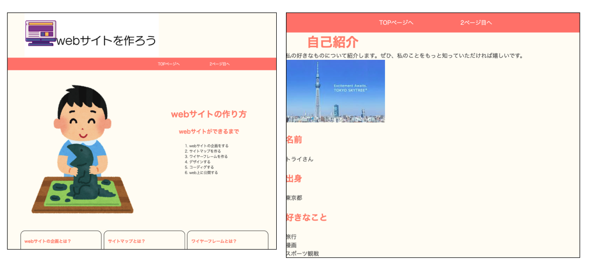
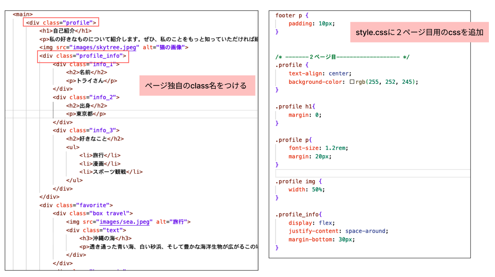
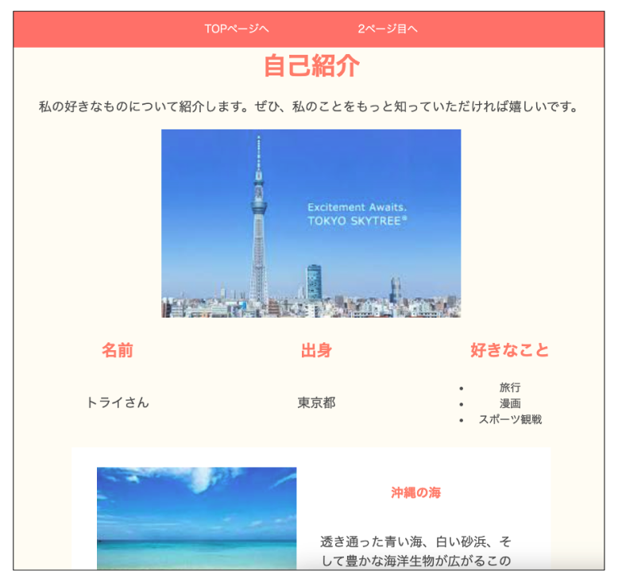

# **オリジナルサイトを作ろう**

## **自己紹介サイトを作ろう**  

- テーマは「好きなもの（こと）を紹介する」ページを作る
- 2ページ以上作る 
- （例）１ページ目「自己紹介」２ページ目「好きなものを紹介」３ページ目「地元の紹介」など

  

## **この単元でやること**

1. 企画を立てる
2. サイトマップを作る
3. レイアウトを考える
4. ワイヤーフレームを作る
5. 配色・デザインコンセプトを決める
6. 共通デザインとページ独自のデザイン
7. コーディングを始めよう

### **①企画**

- どんな内容にするか、イメージしてみよう
- figjamを使って、考えをまとめよう

 

### **②サイトマップを作る**

- どのようなページが必要か考える
- ページ遷移（どのページからどのページに移るか）を考える

 

**figjamを使ってまとめた例**  
手書きや普段使っているツールでまとめてもOK  
この例では６ページを想定していますが、制作期間を考えてページ数を決めましょう  
どんなページを作ったらよいかわからない場合は講師に相談しよう！！

 

### **③レイアウトを考える**

#### **全体のレイアウトを決める**

教科書P174~176を参照して、レイアウトを決めよう  

**【選び方のポイント】**

- 迷ったらベーシックな「①聖杯型レイアウト」でやってみよう
- 写真が多い場合は「②masonry」
- イメージ重視「③フルグラフィック」
  
 

レイアウトを組み合わせても効果的です

 

### **④ワイヤーフレームを作る**

figma,figjamを使って作成  
「01_start」の「7. figmaを使ってみよう」を参照  
ツールに慣れていない場合は紙に手書きやスマホのお絵かきツールなど使ってもよいです

### **⑤デザイン・配色の基本**

**【デザインの基本（必ずやること）】**

余白を取る！！これをやるだけで、見やすくまとまりのあるサイトになります

↓こちらも参考にしよう

https://tsutawarudesign.com/miyasuku4.html

**【配色の基本】**

↓参照して、配色を考えよう

https://tsutawarudesign.com/miyasuku5.html

教科書P192~202も参考になります

  

### **⑥【考えよう！】共通デザイン　と　ページ独自のデザイン**

例えば、２ページ目を下の画像（右側）の内容でHTMLを書くと  
背景、見出し、文字の色が１ページ目と同じデザイン（色）で表示されます  

 

**【サイト全体の一貫性】**

以下の要素を統一することで、サイト全体の一貫性が保たれます。

- ヘッダー（ロゴ、ナビゲーション）
- フッター
- 色使い（背景色、テキストの色、リンクの色）

他にも文字の種類や配置など、デザインの基本的な考え方がありますが、詳しくは別の単元で説明します。  

**`まずは共通部分のデザインを変更して、全体のイメージを決めよう！`**

 

**【ページオリジナルのデザインにするには？】**

そのページ独自のclass名をつけて、cssを切り分ける  
そのページの内容がわかるような名前をつけておくと、コードを探すときに便利です。  

 

   

### **⑦コーディングを始めよう**

何から始めたら良いかわからない人は下のガイドを見てもよいです  
まずは自分で考えてみよう

|    |  ガイド①  |  教科書  |
| :---- | :---- | :---- |
| 1 | フォルダを作成   例：「自己紹介」 | 02 |
| 2 | サイトマップを元にファイルを作成 index.html、style.cssファイル、画像を入れるフォルダ(images)を作成 | 02 |
| 3 | ワイヤーフレームを元にグループを考える 難しい場合は先生にどのようにグループ分けをしたらようか聞いてみよう！ | 03 |
| 4 | １ページ目を作る | 02 |
| 5 | index.htmlに基本構造を作る | 03 |
| 6 | グループを作る 例：「ヘッダー」「メイン」「フッター」のグループを作成 | 03 |
| 7 | ナビゲーションを作る １ページと２ページが行き来できるようにリンクを作る | 04 |
| 8 | メインコンテンツのグループを作る | 03 |

 

|    |  ガイド②  |  教科書  |
| :---- | :---- | :---- |
| 6 | 見出しタイトルを追加 | 05 |
| 7 | 画像を追加 | 06 |
| 8 | コンテンツ追加（見出し、本文、リストなど） | 06 |

 

|    |  ガイド③  |  教科書  |
| :---- | :---- | :---- |
| 9 | cssのリンクを追加 | 08 |
| 10 | リセットcss追加 | 08 |
| 11 | ナビゲーションの装飾 ※一般的な作り方を思い出そう | 09 |
| 12 | 背景色や文字色の変更 | 09 |
| 13 | サイズの変更 | 10 |
| 14 | 余白の追加 ※コンテンツとコンテンツの間に余白を入れて見やすくしよう | 09,12 |
| 15 | 配置の変更 ※横並びの配置にしてみよう | 11 |
| 16 | ２ページ目を作る　index.htmlからコピー　共通部分以外を削除 | 04 |

   